# motion-lab

**Motion graphics drawn entirely in code — one HTML file per piece, every frame deterministic, sound synthesized in the same file.**

No timeline editor, no stock footage, no samples, no fonts to download. Each piece is a single `index.html`: open it and it plays in the browser; hand it to the renderer and it becomes an MP4, frame for frame and sample for sample the same every time.

## Gallery

Click a preview to open the piece live in your browser (click once more there for sound).

<!-- gallery:start -->
<table>
<tr><th>piece</th><th>vertical</th></tr>
<tr>
<td width="72%" valign="top">
<a href="https://bytepatterns.github.io/motion-lab/projects/01-showreel/">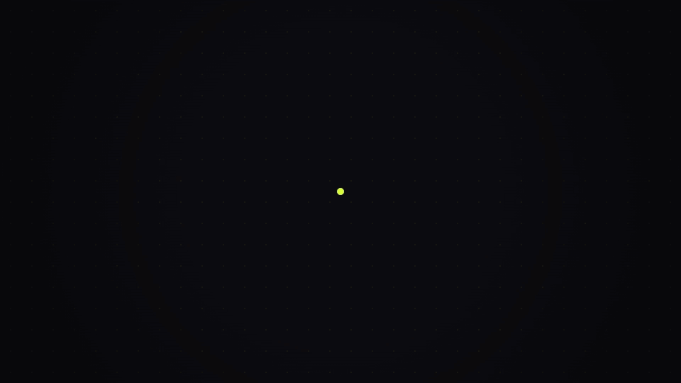</a>
<br><b>01 · Motion Showreel</b> <sub>18 s</sub>
<br>Eighteen seconds of kinetic type, shape morphs, a dive through a letter and a tunnel warp, cut to a synthesized 120 BPM beat.
<br><sub><a href="https://bytepatterns.github.io/motion-lab/projects/01-showreel/">open in browser</a> · <a href="out/01-showreel.png">still</a> · <a href="projects/01-showreel/index.html">source</a></sub>
</td>
<td width="28%" valign="top">
<a href="https://bytepatterns.github.io/motion-lab/projects/01-showreel/?variant=vertical">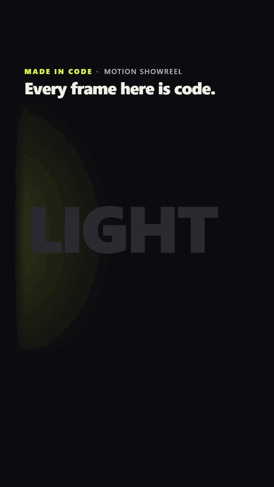</a>
<br><sub>9:16 · 17 s</sub>
<br><sub><a href="https://bytepatterns.github.io/motion-lab/projects/01-showreel/?variant=vertical">open</a> · <a href="out/01-showreel.vertical.png">still</a></sub>
</td>
</tr>
<tr>
<td width="72%" valign="top">
<a href="https://bytepatterns.github.io/motion-lab/projects/02-product-launch/">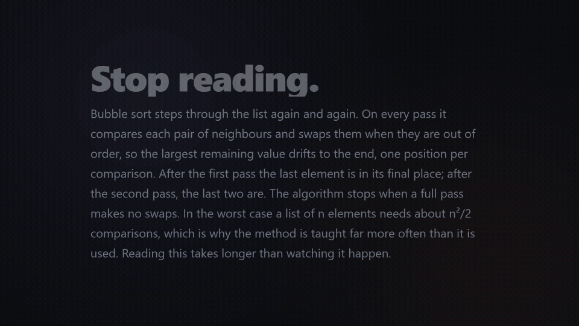</a>
<br><b>02 · BytePatterns Launch Film</b> <sub>24 s</sub>
<br>A 24-second launch film: a paragraph turns into sorted bars, product cards play their own lessons, and 324 tiles light up.
<br><sub><a href="https://bytepatterns.github.io/motion-lab/projects/02-product-launch/">open in browser</a> · <a href="out/02-product-launch.png">still</a> · <a href="projects/02-product-launch/index.html">source</a></sub>
</td>
<td width="28%" valign="top">
<a href="https://bytepatterns.github.io/motion-lab/projects/02-product-launch/?variant=vertical">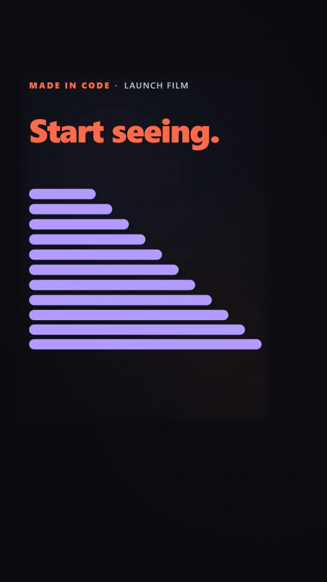</a>
<br><sub>9:16 · 18 s</sub>
<br><sub><a href="https://bytepatterns.github.io/motion-lab/projects/02-product-launch/?variant=vertical">open</a> · <a href="out/02-product-launch.vertical.png">still</a></sub>
</td>
</tr>
<tr>
<td width="72%" valign="top">
<a href="https://bytepatterns.github.io/motion-lab/projects/03-history-of-sorting/">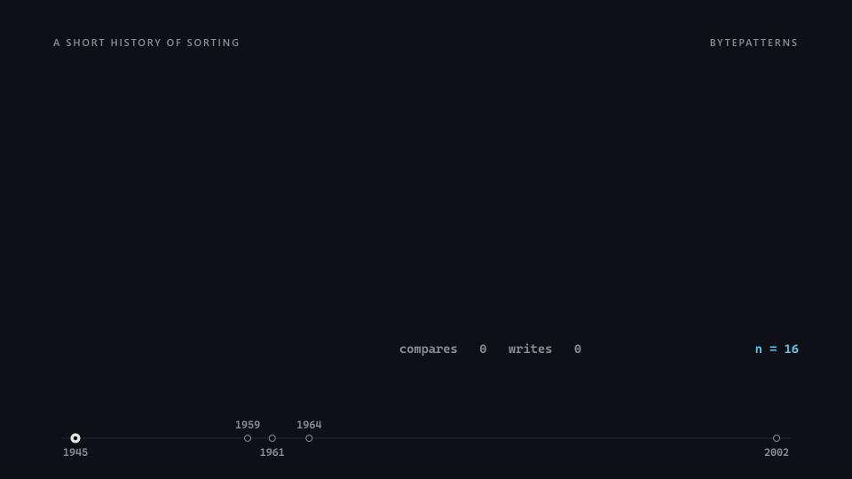</a>
<br><b>03 · A Short History of Sorting</b> <sub>30 s</sub>
<br>Merge sort, Shellsort, quicksort, heapsort and Timsort, 1945 to 2002, each one running for real on a row of bars.
<br><sub><a href="https://bytepatterns.github.io/motion-lab/projects/03-history-of-sorting/">open in browser</a> · <a href="out/03-history-of-sorting.png">still</a> · <a href="projects/03-history-of-sorting/index.html">source</a></sub>
</td>
<td width="28%" valign="top">
<a href="https://bytepatterns.github.io/motion-lab/projects/03-history-of-sorting/?variant=vertical">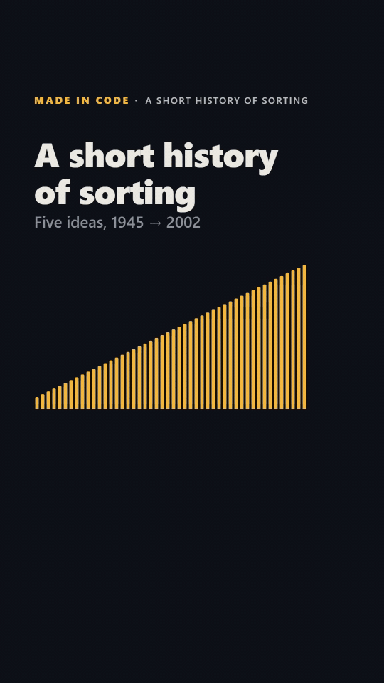</a>
<br><sub>9:16 · 20 s</sub>
<br><sub><a href="https://bytepatterns.github.io/motion-lab/projects/03-history-of-sorting/?variant=vertical">open</a> · <a href="out/03-history-of-sorting.vertical.png">still</a></sub>
</td>
</tr>
<tr>
<td width="72%" valign="top">
<a href="https://bytepatterns.github.io/motion-lab/projects/04-fourier-epicycles/">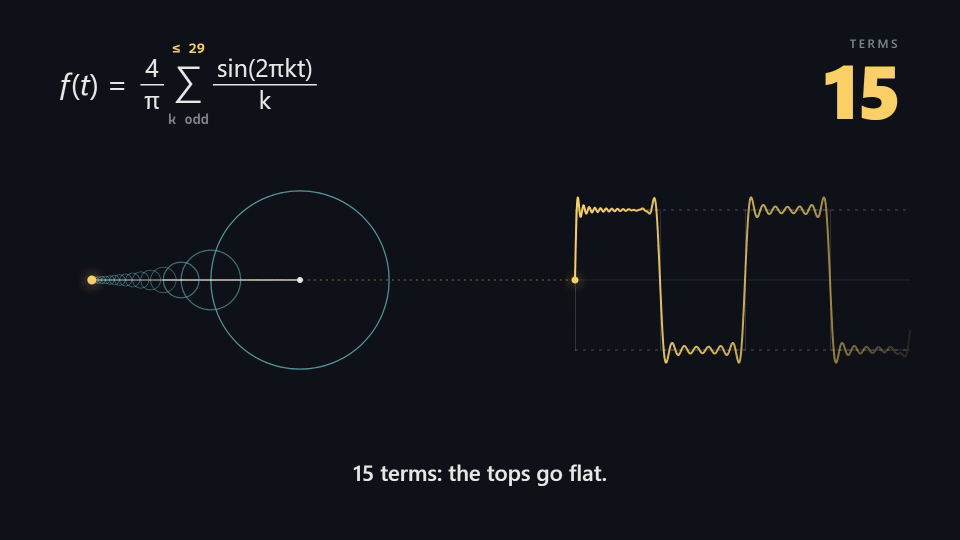</a>
<br><b>04 · Fourier Epicycles</b> <sub>20 s</sub>
<br>Spinning circles add up to a square wave as the series grows from 1 to 31 terms, and you hear the same sum.
<br><sub><a href="https://bytepatterns.github.io/motion-lab/projects/04-fourier-epicycles/">open in browser</a> · <a href="out/04-fourier-epicycles.png">still</a> · <a href="projects/04-fourier-epicycles/index.html">source</a></sub>
</td>
<td width="28%" valign="top">
<a href="https://bytepatterns.github.io/motion-lab/projects/04-fourier-epicycles/?variant=vertical">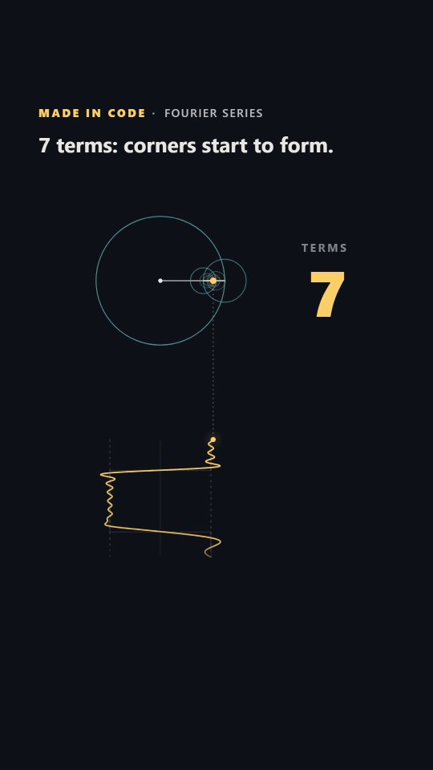</a>
<br><sub>9:16 · 15 s</sub>
<br><sub><a href="https://bytepatterns.github.io/motion-lab/projects/04-fourier-epicycles/?variant=vertical">open</a> · <a href="out/04-fourier-epicycles.vertical.png">still</a></sub>
</td>
</tr>
<tr>
<td width="72%" valign="top">
<a href="https://bytepatterns.github.io/motion-lab/projects/05-double-pendulum/">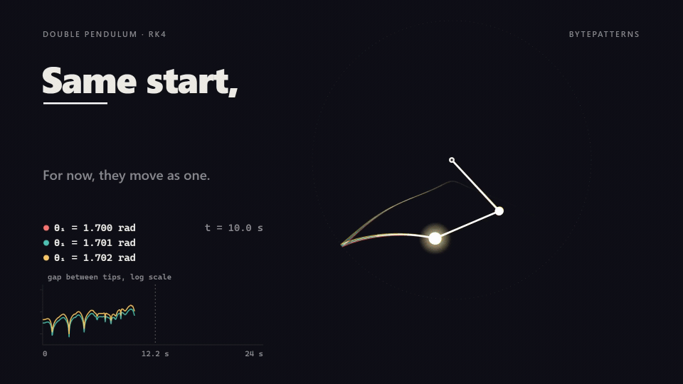</a>
<br><b>05 · Same Start, Different Fate</b> <sub>24 s</sub>
<br>Three double pendulums released 0.001 rad apart move as one, then split apart around the twelve-second mark.
<br><sub><a href="https://bytepatterns.github.io/motion-lab/projects/05-double-pendulum/">open in browser</a> · <a href="out/05-double-pendulum.png">still</a> · <a href="projects/05-double-pendulum/index.html">source</a></sub>
</td>
<td width="28%" valign="top">
<a href="https://bytepatterns.github.io/motion-lab/projects/05-double-pendulum/?variant=vertical">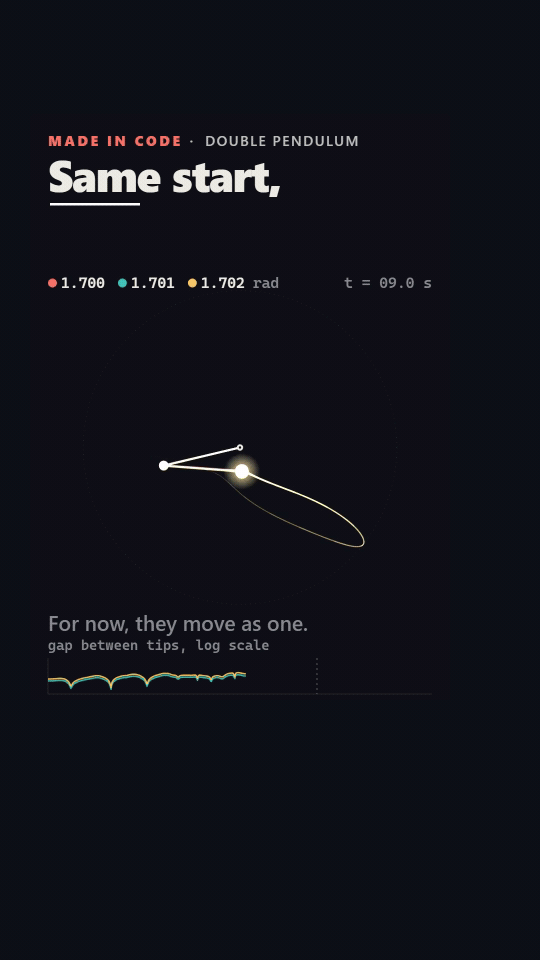</a>
<br><sub>9:16 · 18 s</sub>
<br><sub><a href="https://bytepatterns.github.io/motion-lab/projects/05-double-pendulum/?variant=vertical">open</a> · <a href="out/05-double-pendulum.vertical.png">still</a></sub>
</td>
</tr>
<tr>
<td width="72%" valign="top">
<a href="https://bytepatterns.github.io/motion-lab/projects/06-murmuration/"></a>
<br><b>06 · Murmuration</b> <sub>24 s</sub>
<br>2,400 starlings follow three local rules at dusk, dodge a hawk and draw a letter in the sky.
<br><sub><a href="https://bytepatterns.github.io/motion-lab/projects/06-murmuration/">open in browser</a> · <a href="out/06-murmuration.png">still</a> · <a href="projects/06-murmuration/index.html">source</a></sub>
</td>
<td width="28%" valign="top">
<a href="https://bytepatterns.github.io/motion-lab/projects/06-murmuration/?variant=vertical">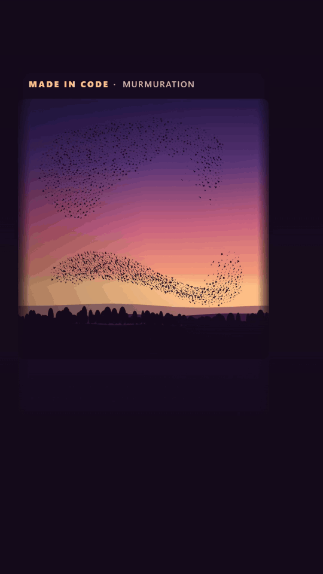</a>
<br><sub>9:16 · 17 s</sub>
<br><sub><a href="https://bytepatterns.github.io/motion-lab/projects/06-murmuration/?variant=vertical">open</a> · <a href="out/06-murmuration.vertical.png">still</a></sub>
</td>
</tr>
<tr>
<td width="72%" valign="top">
<a href="https://bytepatterns.github.io/motion-lab/projects/07-raymarch-city/">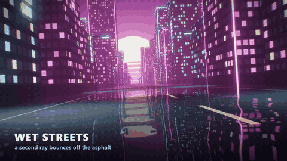</a>
<br><b>07 · Raymarch City</b> <sub>20 s</sub>
<br>A camera flight through a neon city that exists only as a distance function in one fragment shader.
<br><sub><a href="https://bytepatterns.github.io/motion-lab/projects/07-raymarch-city/">open in browser</a> · <a href="out/07-raymarch-city.png">still</a> · <a href="projects/07-raymarch-city/index.html">source</a></sub>
</td>
<td width="28%" valign="top">
<a href="https://bytepatterns.github.io/motion-lab/projects/07-raymarch-city/?variant=vertical">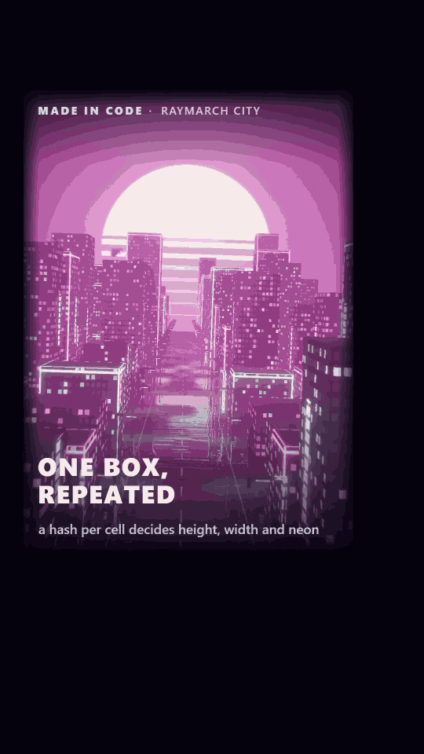</a>
<br><sub>9:16 · 15 s</sub>
<br><sub><a href="https://bytepatterns.github.io/motion-lab/projects/07-raymarch-city/?variant=vertical">open</a> · <a href="out/07-raymarch-city.vertical.png">still</a></sub>
</td>
</tr>
<tr>
<td width="72%" valign="top">
<a href="https://bytepatterns.github.io/motion-lab/projects/08-neon-breakout/">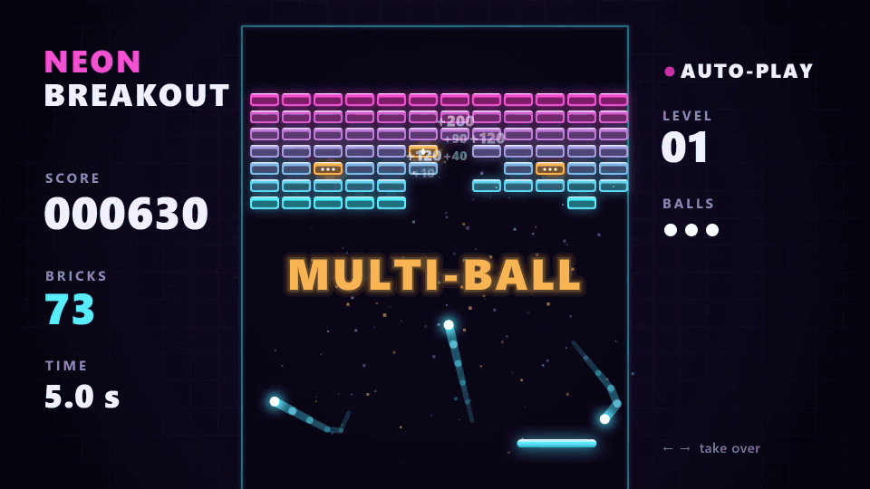</a>
<br><b>08 · Neon Breakout</b> <sub>20 s</sub>
<br>A neon Breakout level that plays itself: deterministic physics, multi-ball, a fire-ball and every brick cleared.
<br><sub><a href="https://bytepatterns.github.io/motion-lab/projects/08-neon-breakout/">open in browser</a> · <a href="out/08-neon-breakout.png">still</a> · <a href="projects/08-neon-breakout/index.html">source</a></sub>
</td>
<td width="28%" valign="top">
<a href="https://bytepatterns.github.io/motion-lab/projects/08-neon-breakout/?variant=vertical">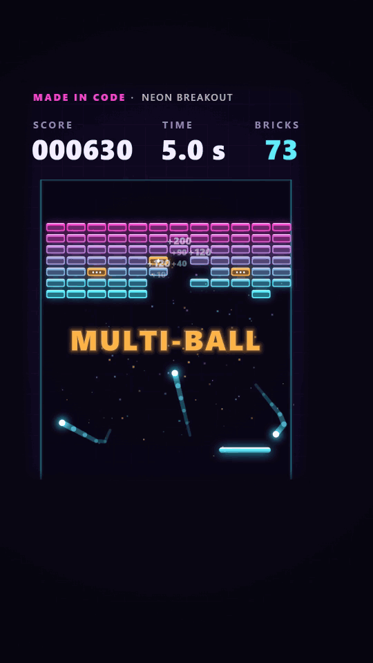</a>
<br><sub>9:16 · 18 s</sub>
<br><sub><a href="https://bytepatterns.github.io/motion-lab/projects/08-neon-breakout/?variant=vertical">open</a> · <a href="out/08-neon-breakout.vertical.png">still</a></sub>
</td>
</tr>
<tr>
<td width="72%" valign="top">
<a href="https://bytepatterns.github.io/motion-lab/projects/09-sorting-race/">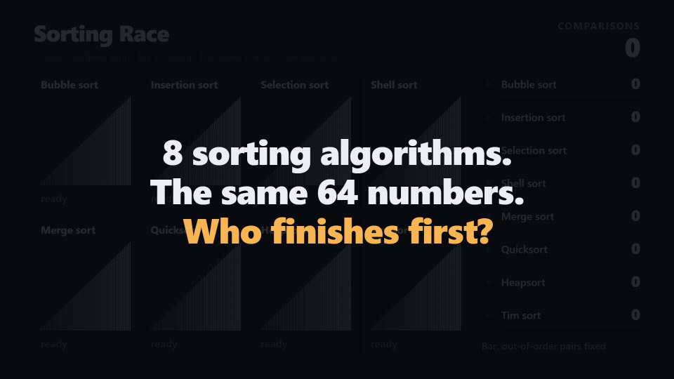</a>
<br><b>09 · Sorting Race</b> <sub>28 s</sub>
<br>Eight sorting algorithms sort the same 64 numbers side by side, paced by their real comparison counts.
<br><sub><a href="https://bytepatterns.github.io/motion-lab/projects/09-sorting-race/">open in browser</a> · <a href="out/09-sorting-race.png">still</a> · <a href="projects/09-sorting-race/index.html">source</a></sub>
</td>
<td width="28%" valign="top">
<a href="https://bytepatterns.github.io/motion-lab/projects/09-sorting-race/?variant=vertical">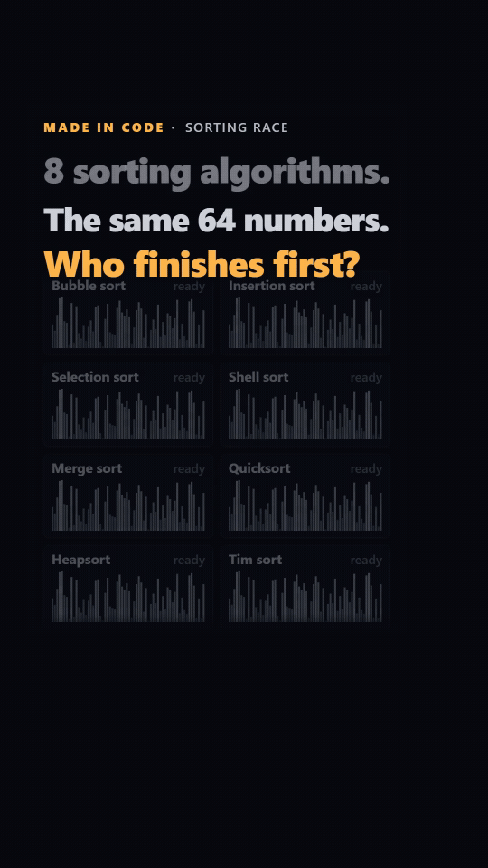</a>
<br><sub>9:16 · 18 s</sub>
<br><sub><a href="https://bytepatterns.github.io/motion-lab/projects/09-sorting-race/?variant=vertical">open</a> · <a href="out/09-sorting-race.vertical.png">still</a></sub>
</td>
</tr>
<tr>
<td width="72%" valign="top">
<a href="https://bytepatterns.github.io/motion-lab/projects/10-title-sequence/">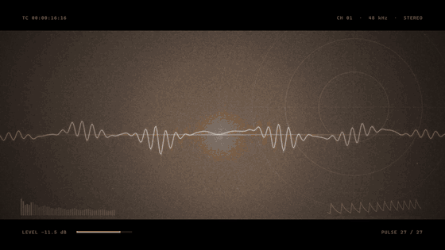</a>
<br><b>10 · Signal</b> <sub>20 s</sub>
<br>A documentary title sequence: one trace, a pulse that keeps quickening, then silence and the title.
<br><sub><a href="https://bytepatterns.github.io/motion-lab/projects/10-title-sequence/">open in browser</a> · <a href="out/10-title-sequence.png">still</a> · <a href="projects/10-title-sequence/index.html">source</a></sub>
</td>
<td width="28%" valign="top">
<a href="https://bytepatterns.github.io/motion-lab/projects/10-title-sequence/?variant=vertical">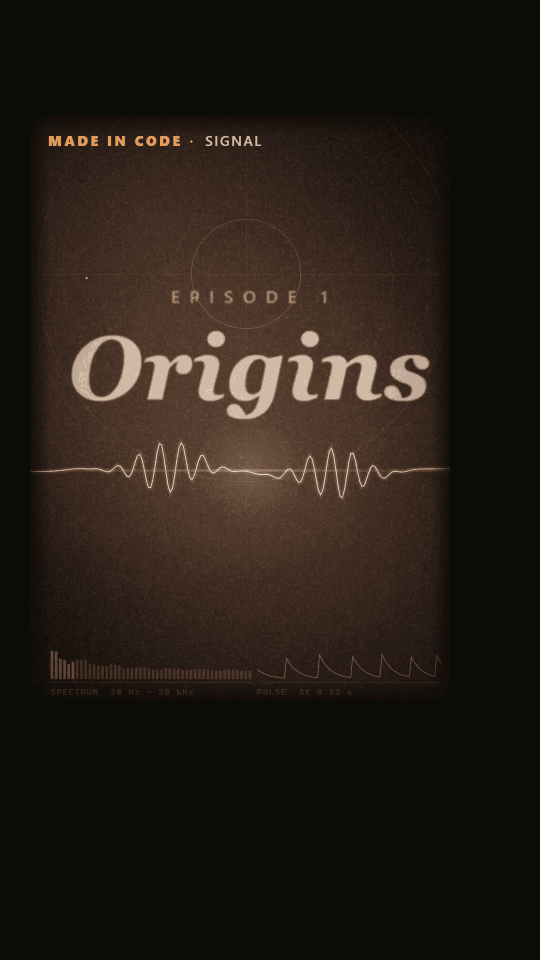</a>
<br><sub>9:16 · 15 s</sub>
<br><sub><a href="https://bytepatterns.github.io/motion-lab/projects/10-title-sequence/?variant=vertical">open</a> · <a href="out/10-title-sequence.vertical.png">still</a></sub>
</td>
</tr>
<tr>
<td width="72%" valign="top">
<a href="https://bytepatterns.github.io/motion-lab/projects/11-game-of-life/">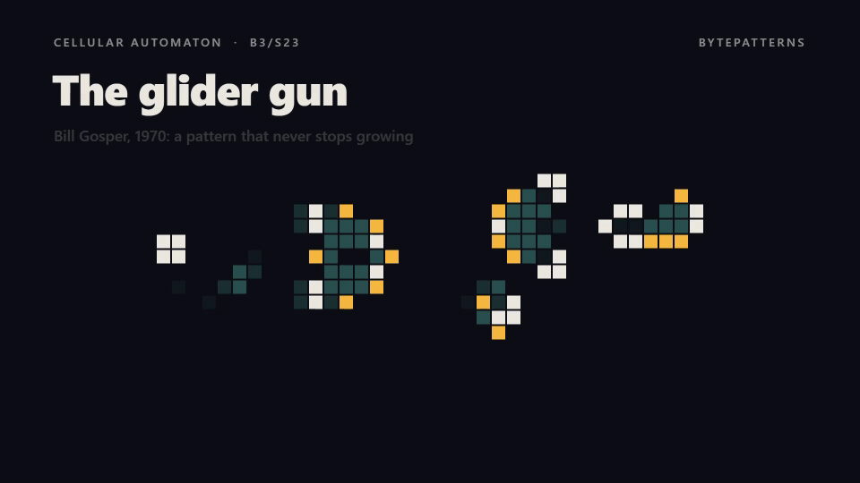</a>
<br><b>11 · The Glider Gun</b> <sub>24 s</sub>
<br>Conway's Game of Life for real: a random soup, the four rules on the R-pentomino, and a Gosper gun firing a glider every 30 generations.
<br><sub><a href="https://bytepatterns.github.io/motion-lab/projects/11-game-of-life/">open in browser</a> · <a href="out/11-game-of-life.png">still</a> · <a href="projects/11-game-of-life/index.html">source</a></sub>
</td>
<td width="28%" valign="top">
<a href="https://bytepatterns.github.io/motion-lab/projects/11-game-of-life/?variant=vertical">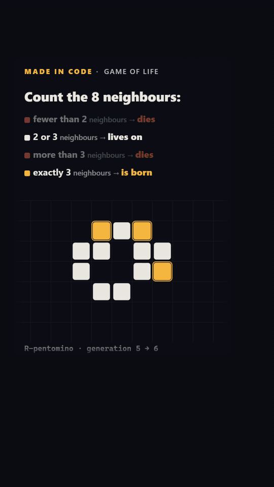</a>
<br><sub>9:16 · 18 s</sub>
<br><sub><a href="https://bytepatterns.github.io/motion-lab/projects/11-game-of-life/?variant=vertical">open</a> · <a href="out/11-game-of-life.vertical.png">still</a></sub>
</td>
</tr>
<tr>
<td width="72%" valign="top">
<a href="https://bytepatterns.github.io/motion-lab/projects/12-maze-search/">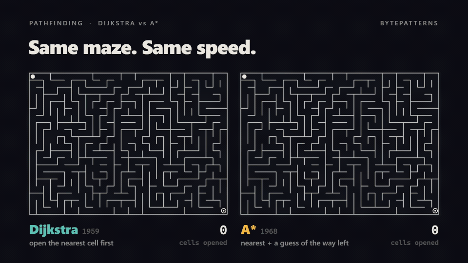</a>
<br><b>12 · Two Ways Out</b> <sub>22 s</sub>
<br>Dijkstra and A* search the same maze at the same speed: one 62-step path, and A* opens a third of the cells to find it.
<br><sub><a href="https://bytepatterns.github.io/motion-lab/projects/12-maze-search/">open in browser</a> · <a href="out/12-maze-search.png">still</a> · <a href="projects/12-maze-search/index.html">source</a></sub>
</td>
<td width="28%" valign="top">
<a href="https://bytepatterns.github.io/motion-lab/projects/12-maze-search/?variant=vertical">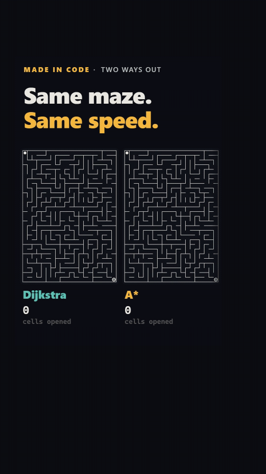</a>
<br><sub>9:16 · 18 s</sub>
<br><sub><a href="https://bytepatterns.github.io/motion-lab/projects/12-maze-search/?variant=vertical">open</a> · <a href="out/12-maze-search.vertical.png">still</a></sub>
</td>
</tr>
<tr>
<td width="72%" valign="top">
<a href="https://bytepatterns.github.io/motion-lab/projects/13-reaction-diffusion/">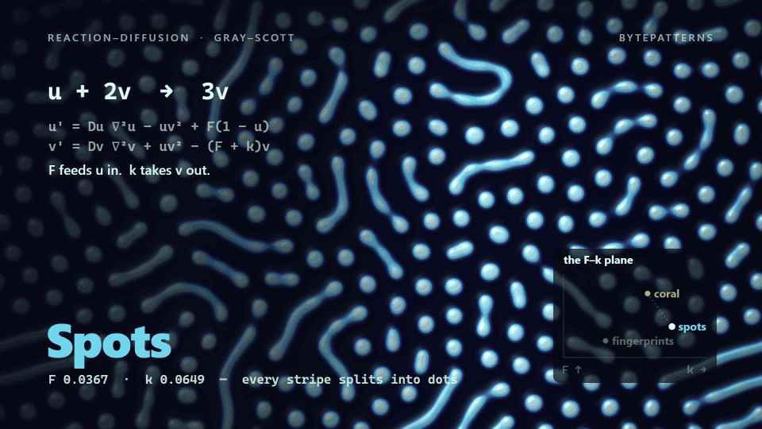</a>
<br><b>13 · Two Numbers</b> <sub>24 s</sub>
<br>A Gray-Scott reaction-diffusion simulation grows coral, splits it into spots and folds it into fingerprints by changing two numbers.
<br><sub><a href="https://bytepatterns.github.io/motion-lab/projects/13-reaction-diffusion/">open in browser</a> · <a href="out/13-reaction-diffusion.png">still</a> · <a href="projects/13-reaction-diffusion/index.html">source</a></sub>
</td>
<td width="28%" valign="top">
<a href="https://bytepatterns.github.io/motion-lab/projects/13-reaction-diffusion/?variant=vertical">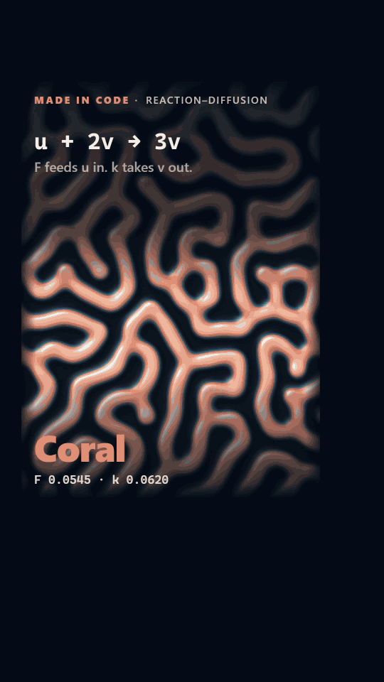</a>
<br><sub>9:16 · 18 s</sub>
<br><sub><a href="https://bytepatterns.github.io/motion-lab/projects/13-reaction-diffusion/?variant=vertical">open</a> · <a href="out/13-reaction-diffusion.vertical.png">still</a></sub>
</td>
</tr>
<tr>
<td width="72%" valign="top">
<a href="https://bytepatterns.github.io/motion-lab/projects/14-six-lines/">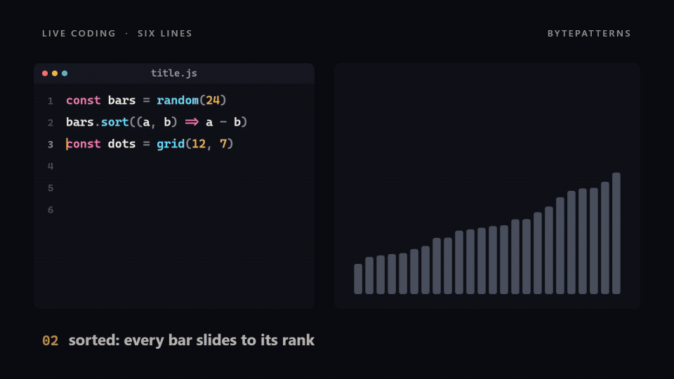</a>
<br><b>14 · Six Lines</b> <sub>20 s</sub>
<br>A title sequence typed live: six lines of code, each one running the moment it is entered, until the last one writes the title.
<br><sub><a href="https://bytepatterns.github.io/motion-lab/projects/14-six-lines/">open in browser</a> · <a href="out/14-six-lines.png">still</a> · <a href="projects/14-six-lines/index.html">source</a></sub>
</td>
<td width="28%" valign="top">
<a href="https://bytepatterns.github.io/motion-lab/projects/14-six-lines/?variant=vertical">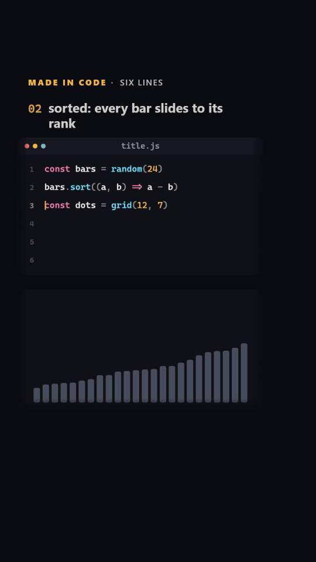</a>
<br><sub>9:16 · 18 s</sub>
<br><sub><a href="https://bytepatterns.github.io/motion-lab/projects/14-six-lines/?variant=vertical">open</a> · <a href="out/14-six-lines.vertical.png">still</a></sub>
</td>
</tr>
<tr>
<td width="72%" valign="top">
<a href="https://bytepatterns.github.io/motion-lab/projects/15-verlet-flag/">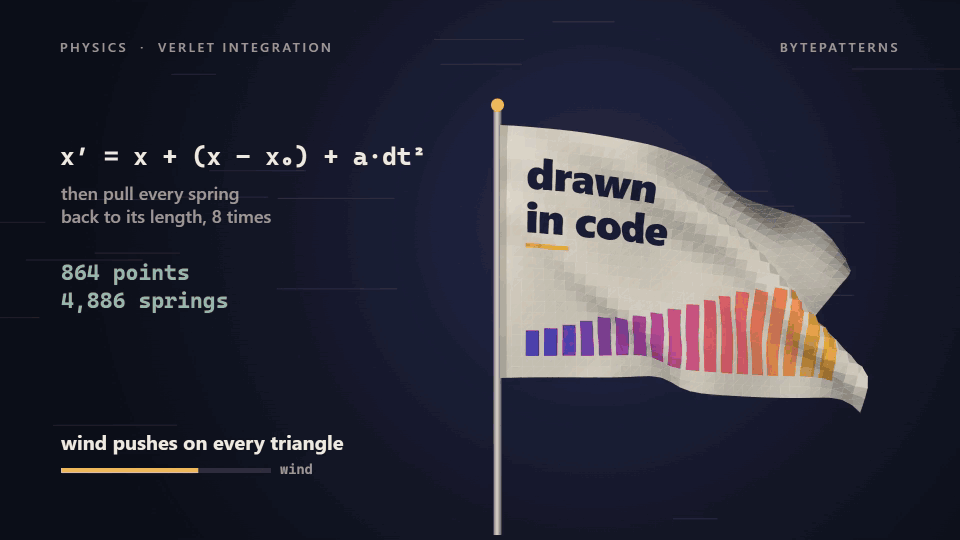</a>
<br><b>15 · Held by Springs</b> <sub>24 s</sub>
<br>A flag of 864 Verlet points and 4,886 springs catches the wind, then a blade cuts 235 springs and it tears.
<br><sub><a href="https://bytepatterns.github.io/motion-lab/projects/15-verlet-flag/">open in browser</a> · <a href="out/15-verlet-flag.png">still</a> · <a href="projects/15-verlet-flag/index.html">source</a></sub>
</td>
<td width="28%" valign="top">
<a href="https://bytepatterns.github.io/motion-lab/projects/15-verlet-flag/?variant=vertical">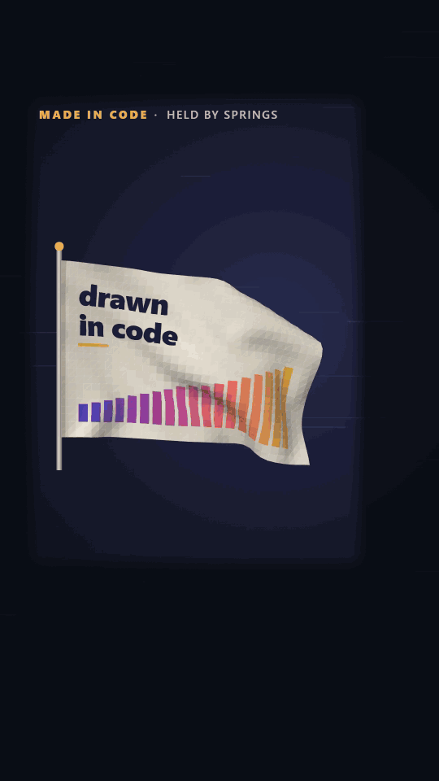</a>
<br><sub>9:16 · 18 s</sub>
<br><sub><a href="https://bytepatterns.github.io/motion-lab/projects/15-verlet-flag/?variant=vertical">open</a> · <a href="out/15-verlet-flag.vertical.png">still</a></sub>
</td>
</tr>
<tr>
<td width="72%" valign="top">
<a href="https://bytepatterns.github.io/motion-lab/projects/16-hash-table/">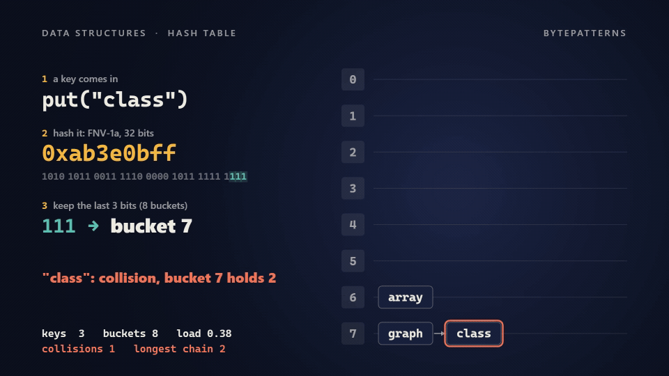</a>
<br><b>16 · Where Keys Go</b> <sub>24 s</sub>
<br>Twelve keys run through a real FNV-1a hash into eight buckets; 5 collisions grow chains, the table doubles to sixteen and every key rehashes by one more bit.
<br><sub><a href="https://bytepatterns.github.io/motion-lab/projects/16-hash-table/">open in browser</a> · <a href="out/16-hash-table.png">still</a> · <a href="projects/16-hash-table/index.html">source</a></sub>
</td>
<td width="28%" valign="top">
<a href="https://bytepatterns.github.io/motion-lab/projects/16-hash-table/?variant=vertical">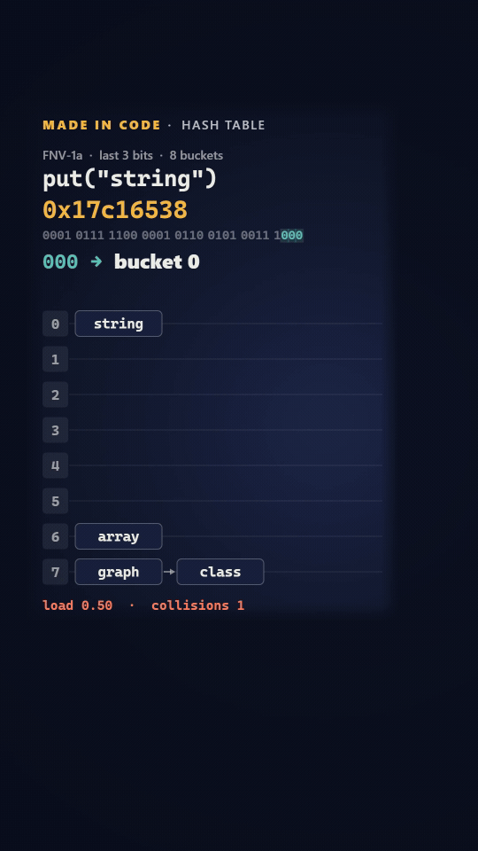</a>
<br><sub>9:16 · 18 s</sub>
<br><sub><a href="https://bytepatterns.github.io/motion-lab/projects/16-hash-table/?variant=vertical">open</a> · <a href="out/16-hash-table.vertical.png">still</a></sub>
</td>
</tr>
<tr>
<td width="72%" valign="top">
<a href="https://bytepatterns.github.io/motion-lab/projects/17-mandelbrot-map/">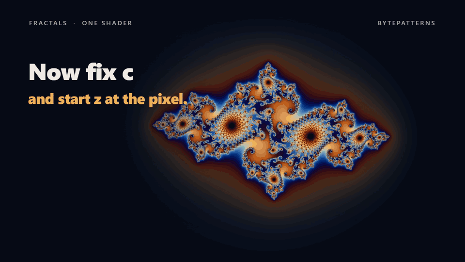</a>
<br><b>17 · The Mandelbrot Map</b> <sub>24 s</sub>
<br>A WebGL shader zooms a thousand times into the Mandelbrot set, then opens the Julia set that lives at the point it zoomed into.
<br><sub><a href="https://bytepatterns.github.io/motion-lab/projects/17-mandelbrot-map/">open in browser</a> · <a href="out/17-mandelbrot-map.png">still</a> · <a href="projects/17-mandelbrot-map/index.html">source</a></sub>
</td>
<td width="28%" valign="top">
<a href="https://bytepatterns.github.io/motion-lab/projects/17-mandelbrot-map/?variant=vertical">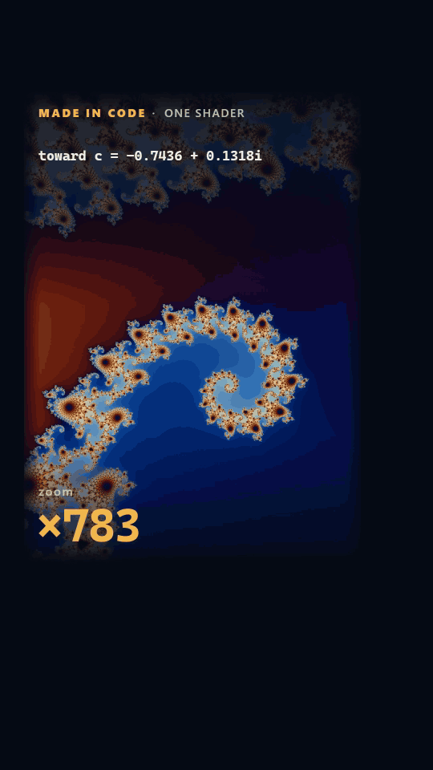</a>
<br><sub>9:16 · 18 s</sub>
<br><sub><a href="https://bytepatterns.github.io/motion-lab/projects/17-mandelbrot-map/?variant=vertical">open</a> · <a href="out/17-mandelbrot-map.vertical.png">still</a></sub>
</td>
</tr>
<tr>
<td width="72%" valign="top">
<a href="https://bytepatterns.github.io/motion-lab/projects/18-big-o/">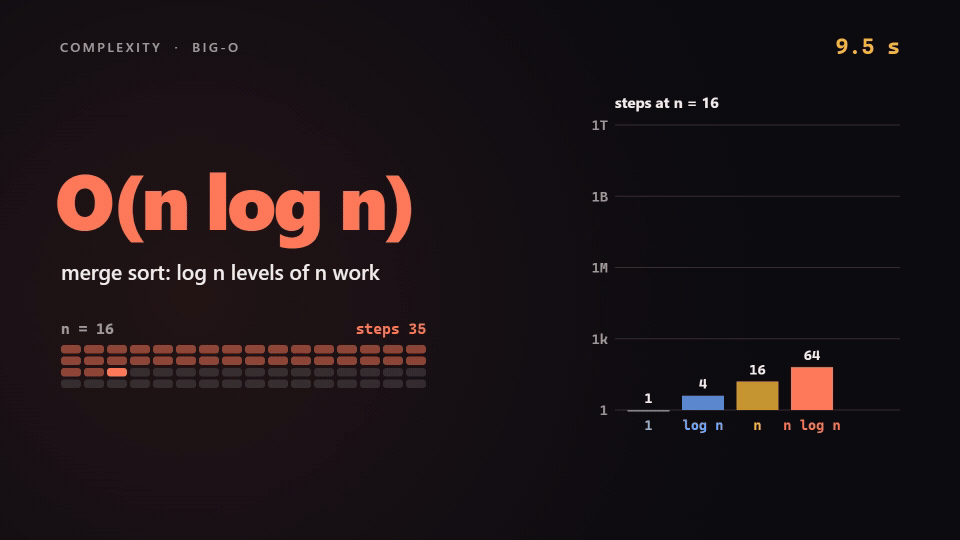</a>
<br><b>18 · Big-O in 20 Seconds</b> <sub>23 s</sub>
<br>Kinetic type against a twenty-second clock: O(1), O(log n), O(n), O(n log n) and O(n²) each count their own steps, then n grows to a million.
<br><sub><a href="https://bytepatterns.github.io/motion-lab/projects/18-big-o/">open in browser</a> · <a href="out/18-big-o.png">still</a> · <a href="projects/18-big-o/index.html">source</a></sub>
</td>
<td width="28%" valign="top">
<a href="https://bytepatterns.github.io/motion-lab/projects/18-big-o/?variant=vertical">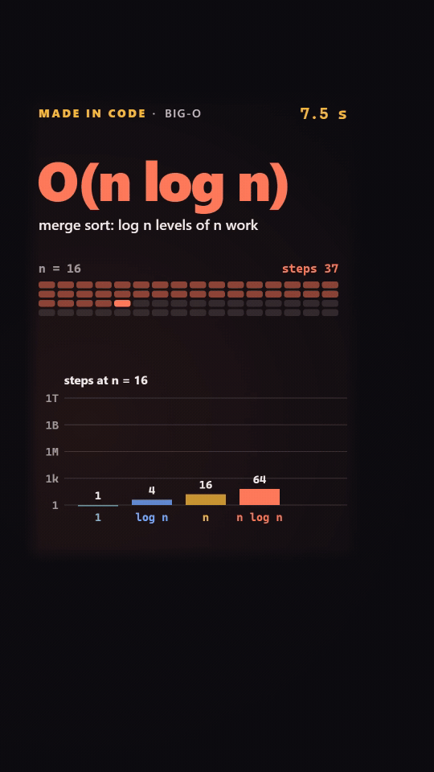</a>
<br><sub>9:16 · 18 s</sub>
<br><sub><a href="https://bytepatterns.github.io/motion-lab/projects/18-big-o/?variant=vertical">open</a> · <a href="out/18-big-o.vertical.png">still</a></sub>
</td>
</tr>
<tr>
<td width="72%" valign="top">
<a href="https://bytepatterns.github.io/motion-lab/projects/19-312-lessons/">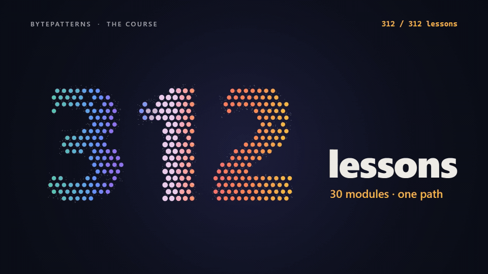</a>
<br><b>19 · 324 Lessons</b> <sub>20 s</sub>
<br>Exactly 324 dots, one for every BytePatterns lesson, fly in and settle into the number 324, then sort themselves into the 31 modules they belong to.
<br><sub><a href="https://bytepatterns.github.io/motion-lab/projects/19-312-lessons/">open in browser</a> · <a href="out/19-312-lessons.png">still</a> · <a href="projects/19-312-lessons/index.html">source</a></sub>
</td>
<td width="28%" valign="top">
<a href="https://bytepatterns.github.io/motion-lab/projects/19-312-lessons/?variant=vertical">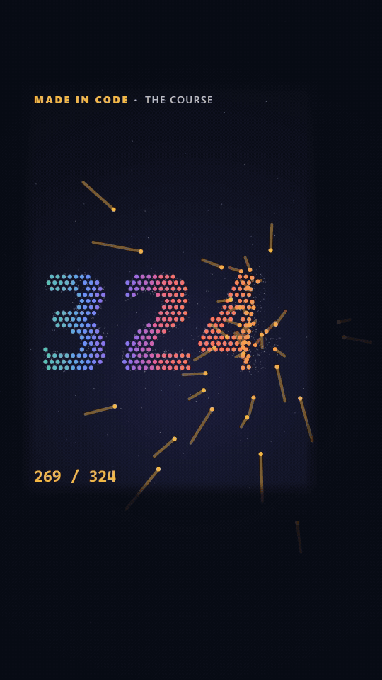</a>
<br><sub>9:16 · 18 s</sub>
<br><sub><a href="https://bytepatterns.github.io/motion-lab/projects/19-312-lessons/?variant=vertical">open</a> · <a href="out/19-312-lessons.vertical.png">still</a></sub>
</td>
</tr>
<tr>
<td width="72%" valign="top">
<a href="https://bytepatterns.github.io/motion-lab/projects/20-domino-chain/">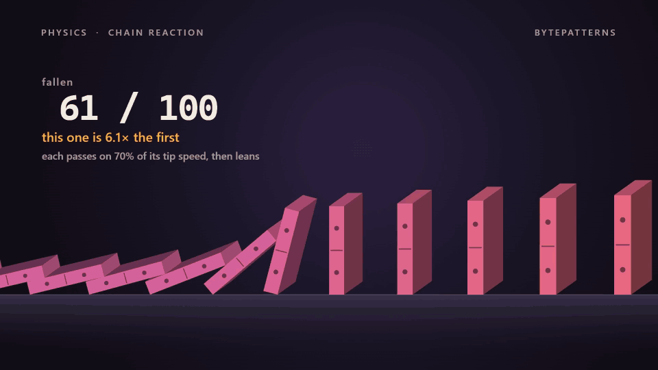</a>
<br><b>20 · Chain Reaction</b> <sub>24 s</sub>
<br>One hundred dominoes, each 3% taller than the one before, topple in a chain until the last one is 18.7 times the height of the first.
<br><sub><a href="https://bytepatterns.github.io/motion-lab/projects/20-domino-chain/">open in browser</a> · <a href="out/20-domino-chain.png">still</a> · <a href="projects/20-domino-chain/index.html">source</a></sub>
</td>
<td width="28%" valign="top">
<a href="https://bytepatterns.github.io/motion-lab/projects/20-domino-chain/?variant=vertical">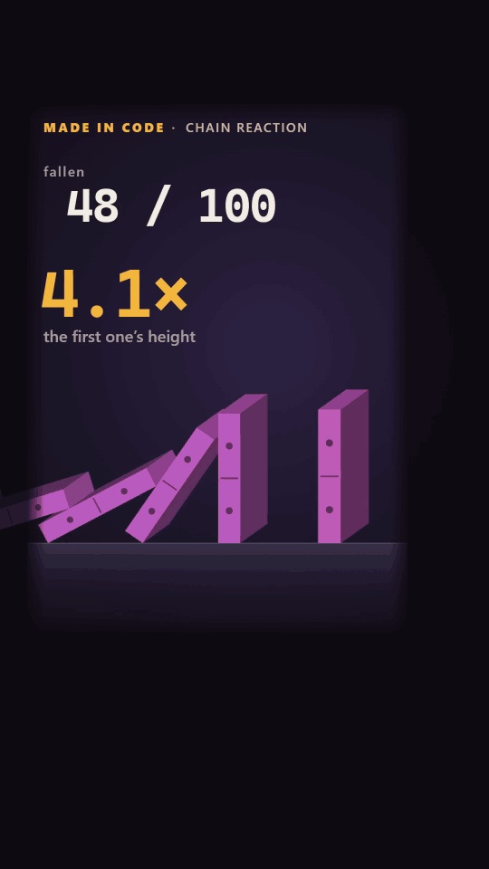</a>
<br><sub>9:16 · 18 s</sub>
<br><sub><a href="https://bytepatterns.github.io/motion-lab/projects/20-domino-chain/?variant=vertical">open</a> · <a href="out/20-domino-chain.vertical.png">still</a></sub>
</td>
</tr>
<tr>
<td width="72%" valign="top">
<a href="https://bytepatterns.github.io/motion-lab/projects/21-rush-hour-dijkstra/">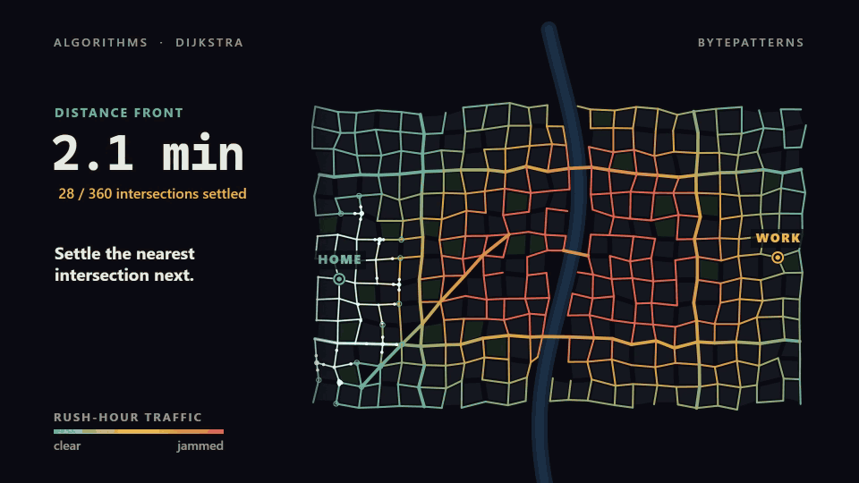</a>
<br><b>21 · Dijkstra at Rush Hour</b> <sub>24 s</sub>
<br>Dijkstra's search spreads through a generated city where every street costs its rush-hour travel time; the fastest way to work is 14% longer than the shortest and 15.4 minutes sooner.
<br><sub><a href="https://bytepatterns.github.io/motion-lab/projects/21-rush-hour-dijkstra/">open in browser</a> · <a href="out/21-rush-hour-dijkstra.png">still</a> · <a href="projects/21-rush-hour-dijkstra/index.html">source</a></sub>
</td>
<td width="28%" valign="top">
<a href="https://bytepatterns.github.io/motion-lab/projects/21-rush-hour-dijkstra/?variant=vertical">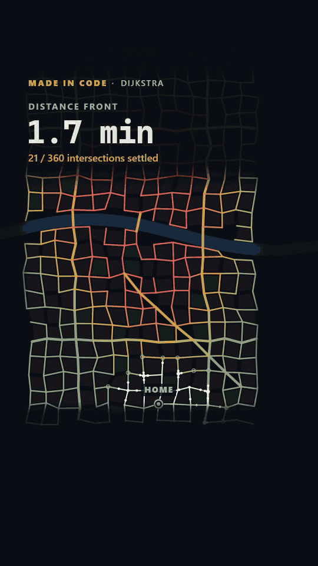</a>
<br><sub>9:16 · 20 s</sub>
<br><sub><a href="https://bytepatterns.github.io/motion-lab/projects/21-rush-hour-dijkstra/?variant=vertical">open</a> · <a href="out/21-rush-hour-dijkstra.vertical.png">still</a></sub>
</td>
</tr>
<tr>
<td width="72%" valign="top">
<a href="https://bytepatterns.github.io/motion-lab/projects/22-rolling-update/">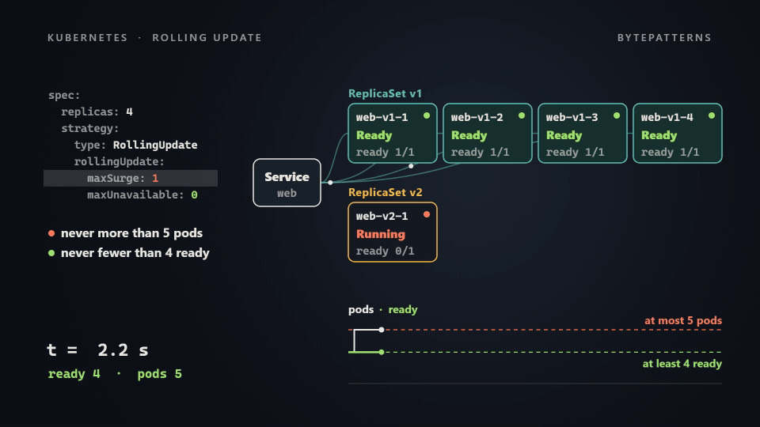</a>
<br><b>22 · Rolling Update</b> <sub>24 s</sub>
<br>A Kubernetes rolling update of 4 pods from v1 to v2 with maxSurge 1 and maxUnavailable 0: each new pod must pass its readiness probe before an old one is let go, so ready pods never drop below 4.
<br><sub><a href="https://bytepatterns.github.io/motion-lab/projects/22-rolling-update/">open in browser</a> · <a href="out/22-rolling-update.png">still</a> · <a href="projects/22-rolling-update/index.html">source</a></sub>
</td>
<td width="28%" valign="top">
<a href="https://bytepatterns.github.io/motion-lab/projects/22-rolling-update/?variant=vertical">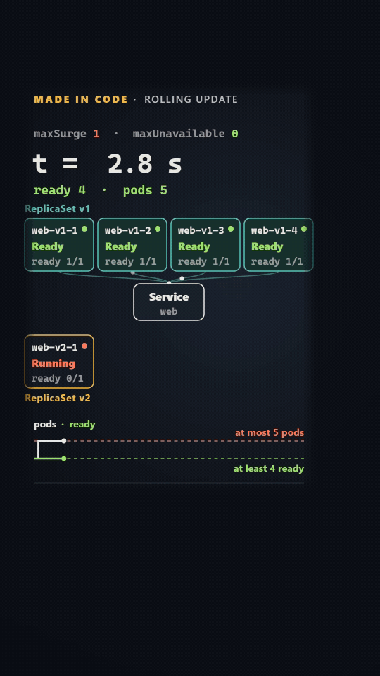</a>
<br><sub>9:16 · 18 s</sub>
<br><sub><a href="https://bytepatterns.github.io/motion-lab/projects/22-rolling-update/?variant=vertical">open</a> · <a href="out/22-rolling-update.vertical.png">still</a></sub>
</td>
</tr>
<tr>
<td width="72%" valign="top">
<a href="https://bytepatterns.github.io/motion-lab/projects/23-token-vs-leaky-bucket/">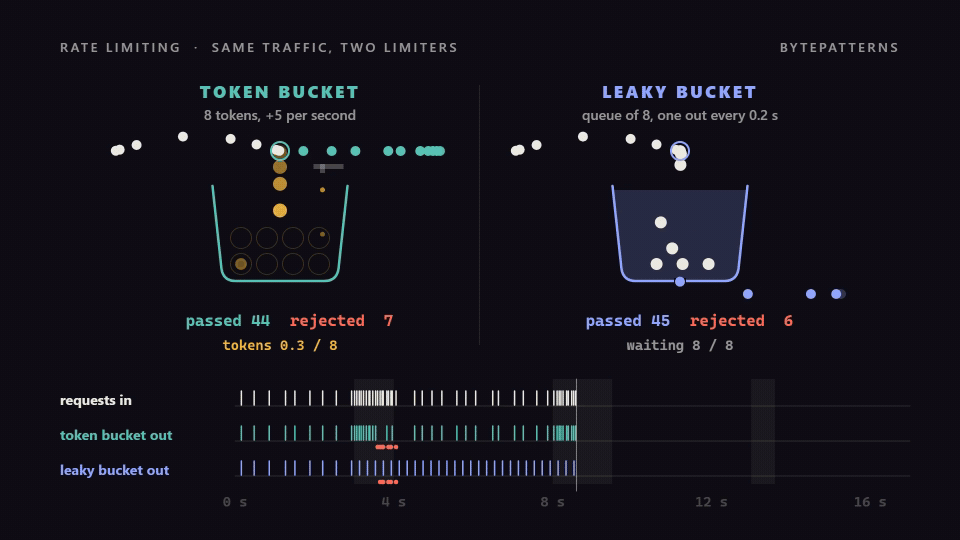</a>
<br><b>23 · Token Bucket vs Leaky Bucket</b> <sub>24 s</sub>
<br>The same 92 bursty requests hit two rate limiters, both 8 deep at 5 per second: the token bucket lets up to 12 through in a second, the leaky bucket never more than 5, at the cost of waits up to 1.6 s.
<br><sub><a href="https://bytepatterns.github.io/motion-lab/projects/23-token-vs-leaky-bucket/">open in browser</a> · <a href="out/23-token-vs-leaky-bucket.png">still</a> · <a href="projects/23-token-vs-leaky-bucket/index.html">source</a></sub>
</td>
<td width="28%" valign="top">
<a href="https://bytepatterns.github.io/motion-lab/projects/23-token-vs-leaky-bucket/?variant=vertical">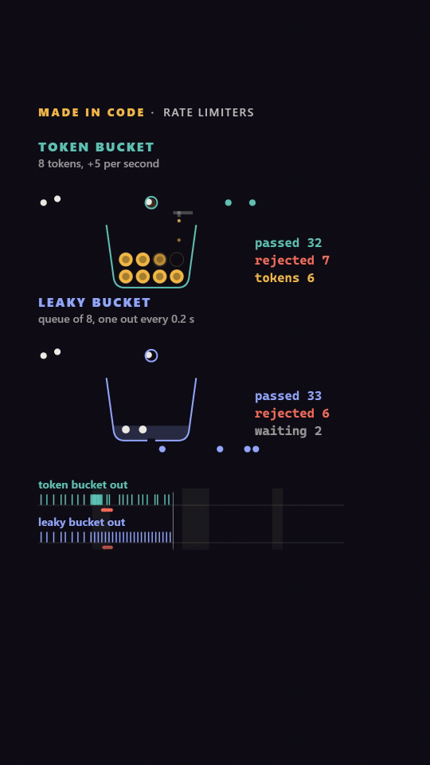</a>
<br><sub>9:16 · 20 s</sub>
<br><sub><a href="https://bytepatterns.github.io/motion-lab/projects/23-token-vs-leaky-bucket/?variant=vertical">open</a> · <a href="out/23-token-vs-leaky-bucket.vertical.png">still</a></sub>
</td>
</tr>
<tr>
<td width="72%" valign="top">
<a href="https://bytepatterns.github.io/motion-lab/projects/24-two-pointers/">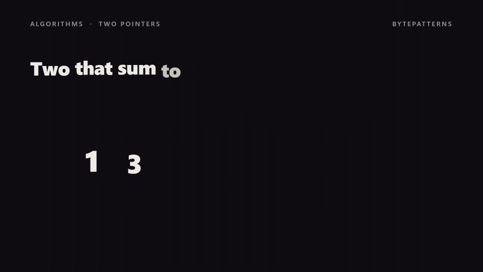</a>
<br><b>24 · Two Pointers</b> <sub>24 s</sub>
<br>Kinetic type where the words left and right are the pointers: they check that 14 letters read the same both ways, find the pair that sums to 19 in 4 steps and reverse STRESSED in 4 swaps.
<br><sub><a href="https://bytepatterns.github.io/motion-lab/projects/24-two-pointers/">open in browser</a> · <a href="out/24-two-pointers.png">still</a> · <a href="projects/24-two-pointers/index.html">source</a></sub>
</td>
<td width="28%" valign="top">
<a href="https://bytepatterns.github.io/motion-lab/projects/24-two-pointers/?variant=vertical">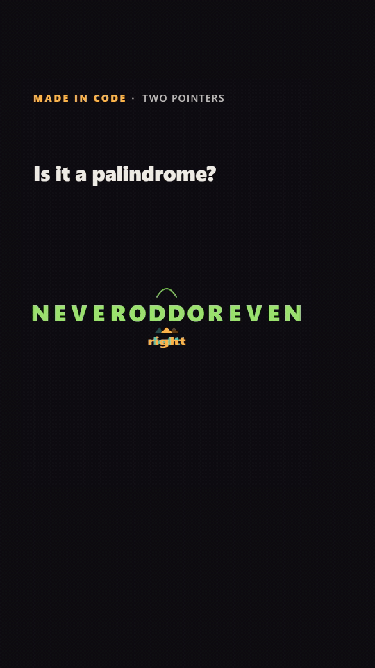</a>
<br><sub>9:16 · 19 s</sub>
<br><sub><a href="https://bytepatterns.github.io/motion-lab/projects/24-two-pointers/?variant=vertical">open</a> · <a href="out/24-two-pointers.vertical.png">still</a></sub>
</td>
</tr>
<tr>
<td width="72%" valign="top">
<a href="https://bytepatterns.github.io/motion-lab/projects/25-liquid-letters/">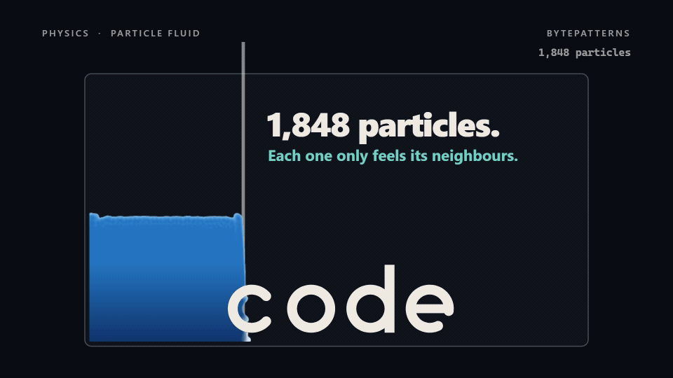</a>
<br><b>25 · Liquid Letters</b> <sub>24 s</sub>
<br>1,848 simulated particles of water are released from a dam, crash over the word &quot;code&quot; and slosh through its letters as the tank tilts; the surface is drawn around the particles in every frame.
<br><sub><a href="https://bytepatterns.github.io/motion-lab/projects/25-liquid-letters/">open in browser</a> · <a href="out/25-liquid-letters.png">still</a> · <a href="projects/25-liquid-letters/index.html">source</a></sub>
</td>
<td width="28%" valign="top">
<a href="https://bytepatterns.github.io/motion-lab/projects/25-liquid-letters/?variant=vertical">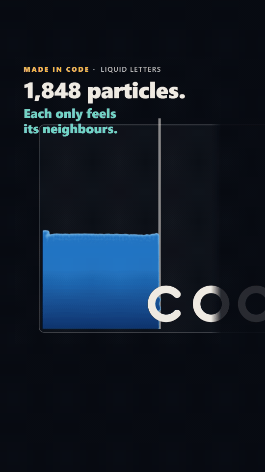</a>
<br><sub>9:16 · 18 s</sub>
<br><sub><a href="https://bytepatterns.github.io/motion-lab/projects/25-liquid-letters/?variant=vertical">open</a> · <a href="out/25-liquid-letters.vertical.png">still</a></sub>
</td>
</tr>
<tr>
<td width="72%" valign="top">
<a href="https://bytepatterns.github.io/motion-lab/projects/26-merge-sort-tree/">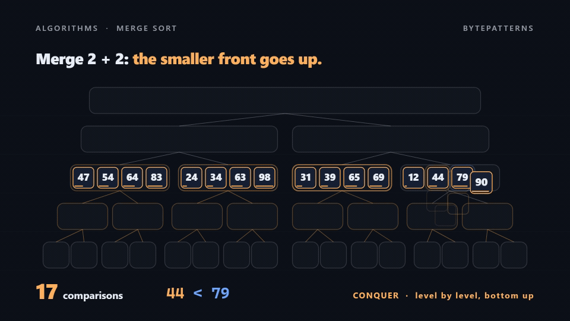</a>
<br><b>26 · Merge Sort, Drawn as a Tree</b> <sub>26 s</sub>
<br>A real merge sort of 16 numbers drawn as its recursion tree: the row halves 4 times down to single tiles, then merges back up level by level in 45 comparisons, one tick each.
<br><sub><a href="https://bytepatterns.github.io/motion-lab/projects/26-merge-sort-tree/">open in browser</a> · <a href="out/26-merge-sort-tree.png">still</a> · <a href="projects/26-merge-sort-tree/index.html">source</a></sub>
</td>
<td width="28%" valign="top">
<a href="https://bytepatterns.github.io/motion-lab/projects/26-merge-sort-tree/?variant=vertical">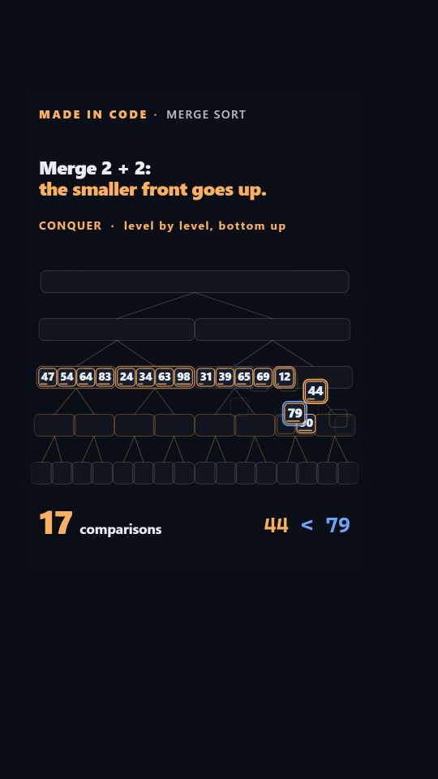</a>
<br><sub>9:16 · 19 s</sub>
<br><sub><a href="https://bytepatterns.github.io/motion-lab/projects/26-merge-sort-tree/?variant=vertical">open</a> · <a href="out/26-merge-sort-tree.vertical.png">still</a></sub>
</td>
</tr>
<tr>
<td width="72%" valign="top">
<a href="https://bytepatterns.github.io/motion-lab/projects/27-consistent-hashing/">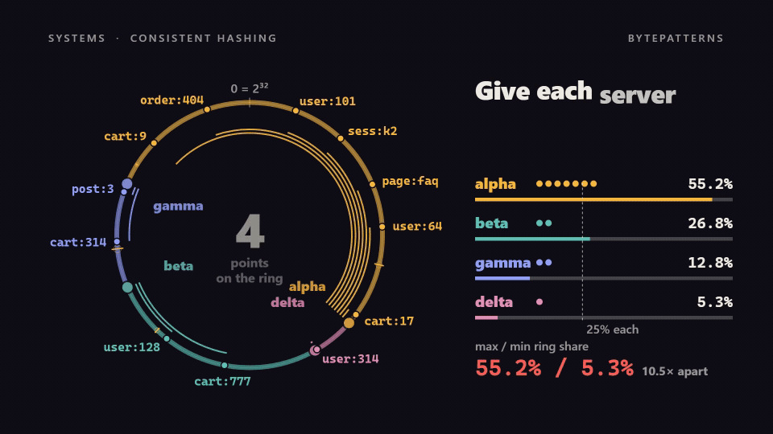</a>
<br><b>27 · Consistent Hashing</b> <sub>25 s</sub>
<br>Four servers and 12 keys hashed onto one ring with 32-bit FNV-1a: one point per server gives shares from 5.3% to 55.2%, 32 virtual points each bring them to 23.7%..26.2%, and when one server goes down 3 of 12 keys move, against 10 with hash mod N.
<br><sub><a href="https://bytepatterns.github.io/motion-lab/projects/27-consistent-hashing/">open in browser</a> · <a href="out/27-consistent-hashing.png">still</a> · <a href="projects/27-consistent-hashing/index.html">source</a></sub>
</td>
<td width="28%" valign="top">
<a href="https://bytepatterns.github.io/motion-lab/projects/27-consistent-hashing/?variant=vertical">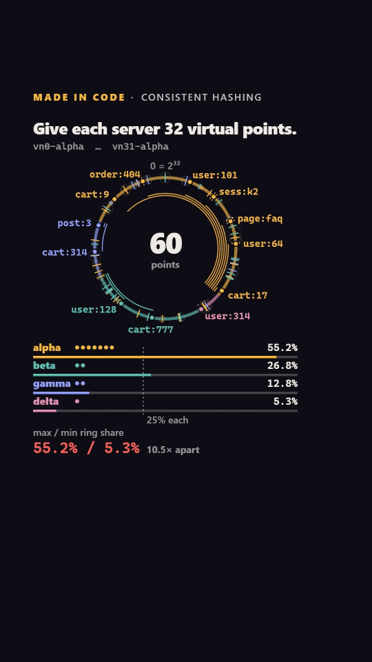</a>
<br><sub>9:16 · 20 s</sub>
<br><sub><a href="https://bytepatterns.github.io/motion-lab/projects/27-consistent-hashing/?variant=vertical">open</a> · <a href="out/27-consistent-hashing.vertical.png">still</a></sub>
</td>
</tr>
<tr>
<td width="72%" valign="top">
<a href="https://bytepatterns.github.io/motion-lab/projects/28-binary-search-halves/">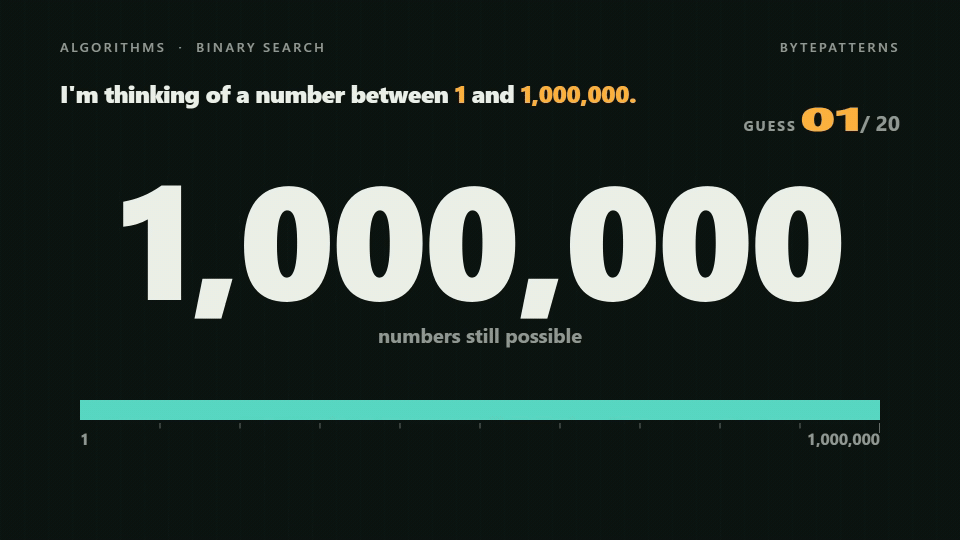</a>
<br><b>28 · Binary Search Halves It</b> <sub>22 s</sub>
<br>Kinetic type: binary search finds the hidden number 95,321 between 1 and 1,000,000 in 20 guesses (7 higher, 12 lower, then found); the count of numbers still possible halves from 1,000,000 to 1 as the number line zooms in, and log2 of 1,000,000 is 19.93.
<br><sub><a href="https://bytepatterns.github.io/motion-lab/projects/28-binary-search-halves/">open in browser</a> · <a href="out/28-binary-search-halves.png">still</a> · <a href="projects/28-binary-search-halves/index.html">source</a></sub>
</td>
<td width="28%" valign="top">
<a href="https://bytepatterns.github.io/motion-lab/projects/28-binary-search-halves/?variant=vertical">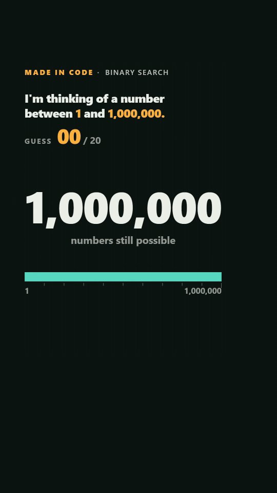</a>
<br><sub>9:16 · 20 s</sub>
<br><sub><a href="https://bytepatterns.github.io/motion-lab/projects/28-binary-search-halves/?variant=vertical">open</a> · <a href="out/28-binary-search-halves.vertical.png">still</a></sub>
</td>
</tr>
<tr>
<td width="72%" valign="top">
<a href="https://bytepatterns.github.io/motion-lab/projects/29-harmonograph/">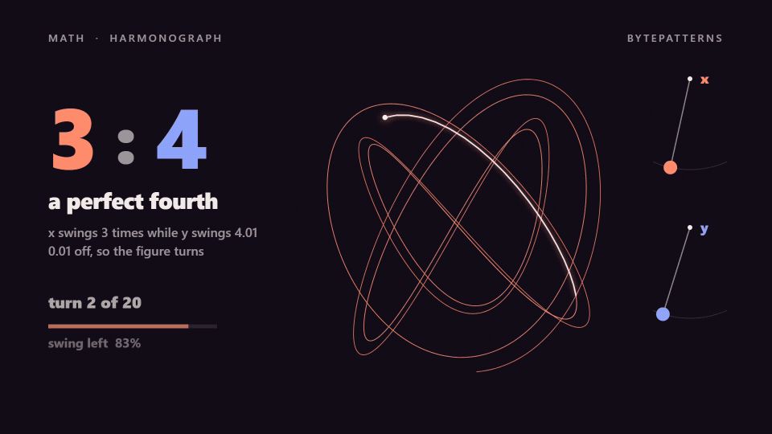</a>
<br><b>29 · Harmonograph</b> <sub>27 s</sub>
<br>Two damped pendulums steer one pen through 2:3, 3:4, 1:2, a fifth, a fourth and an octave: each figure is 20 turns of the same sum, drawn until the swing has decayed to 11-14%, and the soundtrack plays that sum as two decaying tones.
<br><sub><a href="https://bytepatterns.github.io/motion-lab/projects/29-harmonograph/">open in browser</a> · <a href="out/29-harmonograph.png">still</a> · <a href="projects/29-harmonograph/index.html">source</a></sub>
</td>
<td width="28%" valign="top">
<a href="https://bytepatterns.github.io/motion-lab/projects/29-harmonograph/?variant=vertical">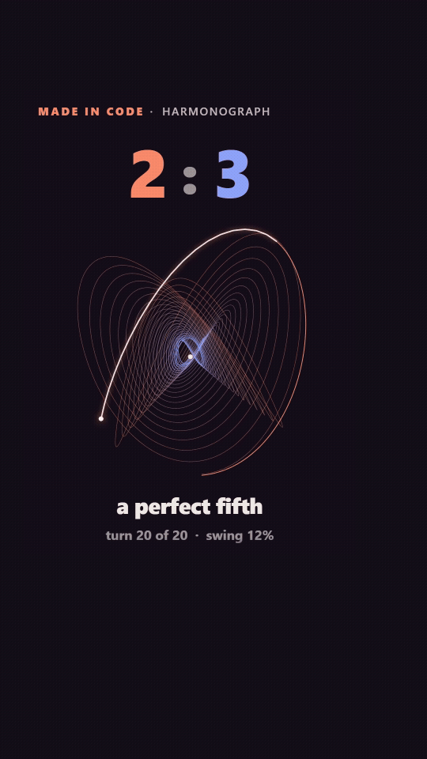</a>
<br><sub>9:16 · 20 s</sub>
<br><sub><a href="https://bytepatterns.github.io/motion-lab/projects/29-harmonograph/?variant=vertical">open</a> · <a href="out/29-harmonograph.vertical.png">still</a></sub>
</td>
</tr>
<tr>
<td width="72%" valign="top">
<a href="https://bytepatterns.github.io/motion-lab/projects/30-rule-30/">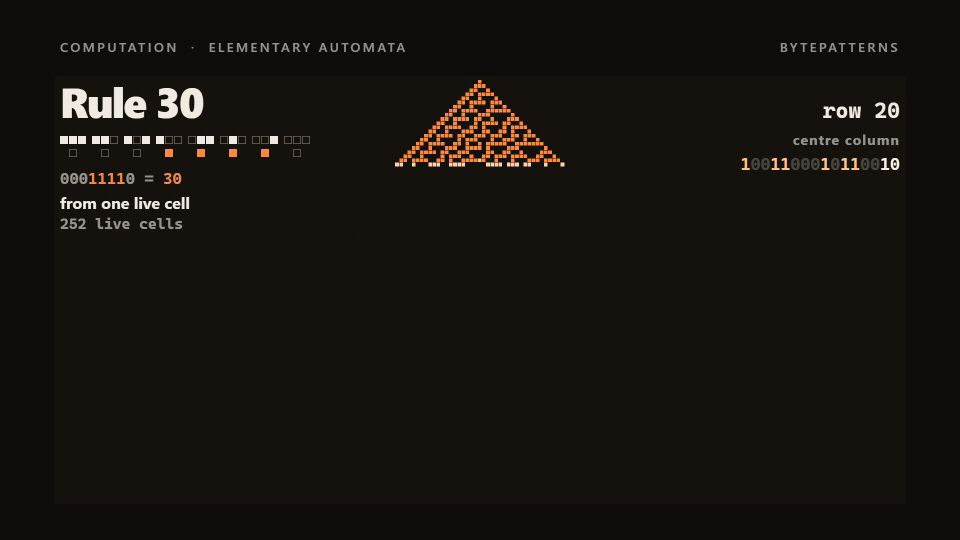</a>
<br><b>30 · One Row at a Time</b> <sub>27 s</sub>
<br>Elementary cellular automata drawn one row at a time: the eight cases of rule 30 (00011110), its chaotic triangle grown from one live cell over 105 rows (5,720 live cells) with a click per row pitched by its centre column, rule 110 from 85 random cells, and a last rule-30 cascade whose rows are then steered cell by cell onto a 5x7 bitmap of the word &quot;code&quot; (6,088 cells changed).
<br><sub><a href="https://bytepatterns.github.io/motion-lab/projects/30-rule-30/">open in browser</a> · <a href="out/30-rule-30.png">still</a> · <a href="projects/30-rule-30/index.html">source</a></sub>
</td>
<td width="28%" valign="top">
<a href="https://bytepatterns.github.io/motion-lab/projects/30-rule-30/?variant=vertical">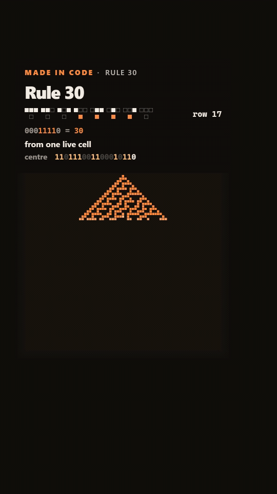</a>
<br><sub>9:16 · 20 s</sub>
<br><sub><a href="https://bytepatterns.github.io/motion-lab/projects/30-rule-30/?variant=vertical">open</a> · <a href="out/30-rule-30.vertical.png">still</a></sub>
</td>
</tr>
<tr>
<td width="72%" valign="top">
<a href="https://bytepatterns.github.io/motion-lab/projects/31-heap-sift/">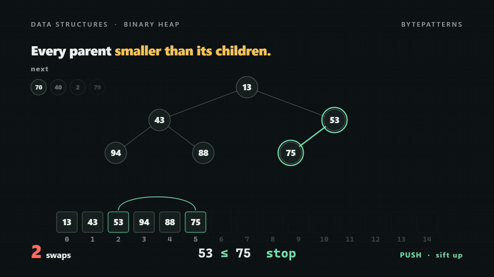</a>
<br><b>31 · Heap: Sift Up, Sift Down</b> <sub>27 s</sub>
<br>A real min-heap drawn as a tree over the array it lives in: 15 pushes sift up with 14 swaps (one climbs 3 levels to the root), then 3 pops sift down with 7 more and come out in order, 2, 4, 13; one tick per swap.
<br><sub><a href="https://bytepatterns.github.io/motion-lab/projects/31-heap-sift/">open in browser</a> · <a href="out/31-heap-sift.png">still</a> · <a href="projects/31-heap-sift/index.html">source</a></sub>
</td>
<td width="28%" valign="top">
<a href="https://bytepatterns.github.io/motion-lab/projects/31-heap-sift/?variant=vertical">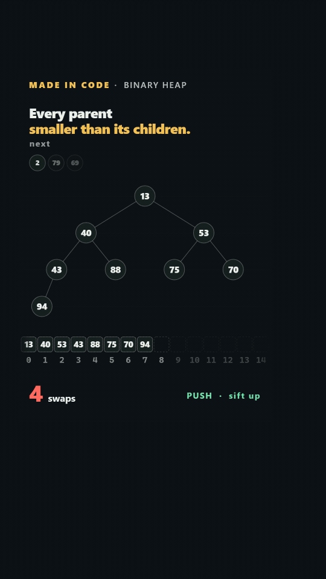</a>
<br><sub>9:16 · 19 s</sub>
<br><sub><a href="https://bytepatterns.github.io/motion-lab/projects/31-heap-sift/?variant=vertical">open</a> · <a href="out/31-heap-sift.vertical.png">still</a></sub>
</td>
</tr>
<tr>
<td width="72%" valign="top">
<a href="https://bytepatterns.github.io/motion-lab/projects/32-load-balancer/">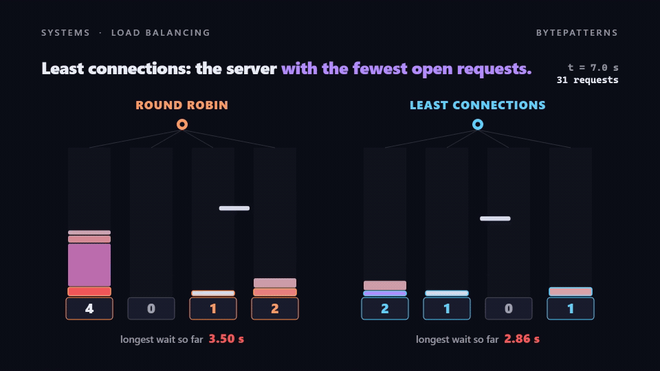</a>
<br><b>32 · Round Robin vs Least Connections</b> <sub>24 s</sub>
<br>The same 65 seeded requests (10 of them long) go through two load balancers to four servers each, stacked as blocks of remaining work: round robin waits 1.14 s on average (p95 3.98 s), least connections 0.29 s (p95 1.76 s); on 200 other seeded streams least connections had the lower p95 wait 192 times.
<br><sub><a href="https://bytepatterns.github.io/motion-lab/projects/32-load-balancer/">open in browser</a> · <a href="out/32-load-balancer.png">still</a> · <a href="projects/32-load-balancer/index.html">source</a></sub>
</td>
<td width="28%" valign="top">
<a href="https://bytepatterns.github.io/motion-lab/projects/32-load-balancer/?variant=vertical">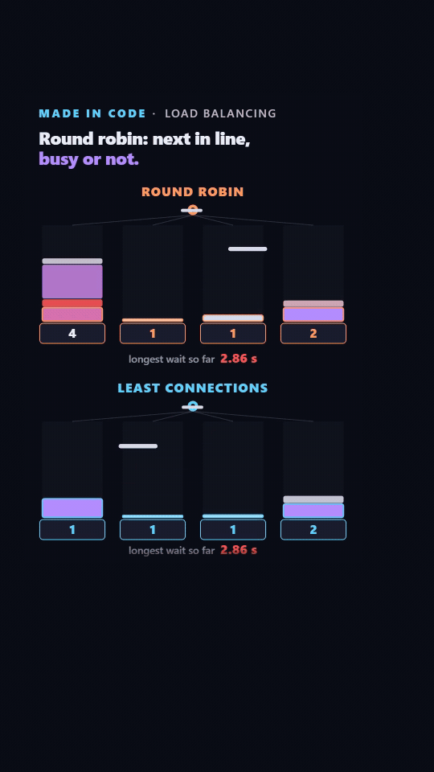</a>
<br><sub>9:16 · 19 s</sub>
<br><sub><a href="https://bytepatterns.github.io/motion-lab/projects/32-load-balancer/?variant=vertical">open</a> · <a href="out/32-load-balancer.vertical.png">still</a></sub>
</td>
</tr>
<tr>
<td width="72%" valign="top">
<a href="https://bytepatterns.github.io/motion-lab/projects/33-bloom-filter/">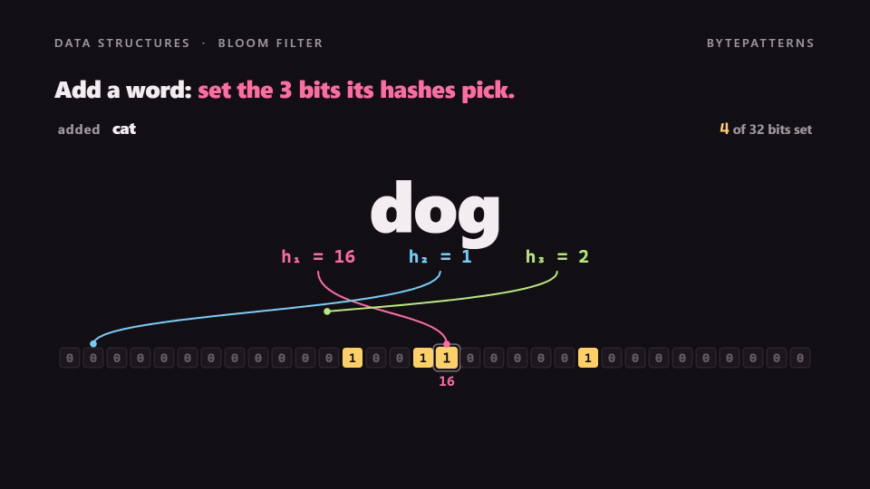</a>
<br><b>33 · Bloom Filter: No, or Maybe</b> <sub>27 s</sub>
<br>Kinetic type: 7 words go into a 32-bit Bloom filter through 3 hashes each (32-bit FNV-1a of &quot;i:word&quot; mod 32), setting 14 bits; then &quot;fox&quot; comes back maybe, &quot;yak&quot; definitely not, and &quot;emu&quot;, never added, maybe: a false positive. Of 1,000 strings never added, 80 came back maybe.
<br><sub><a href="https://bytepatterns.github.io/motion-lab/projects/33-bloom-filter/">open in browser</a> · <a href="out/33-bloom-filter.png">still</a> · <a href="projects/33-bloom-filter/index.html">source</a></sub>
</td>
<td width="28%" valign="top">
<a href="https://bytepatterns.github.io/motion-lab/projects/33-bloom-filter/?variant=vertical">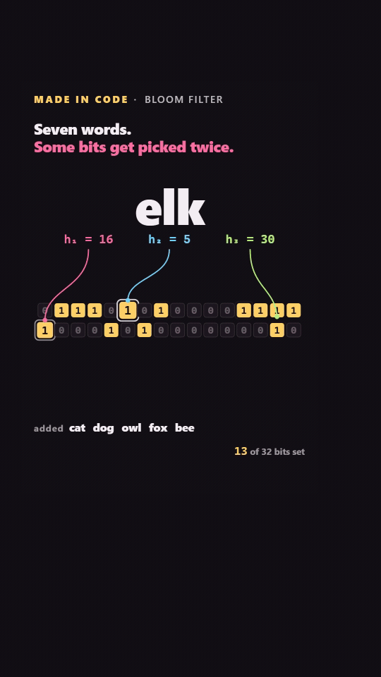</a>
<br><sub>9:16 · 19 s</sub>
<br><sub><a href="https://bytepatterns.github.io/motion-lab/projects/33-bloom-filter/?variant=vertical">open</a> · <a href="out/33-bloom-filter.vertical.png">still</a></sub>
</td>
</tr>
<tr>
<td width="72%" valign="top">
<a href="https://bytepatterns.github.io/motion-lab/projects/34-flow-field/">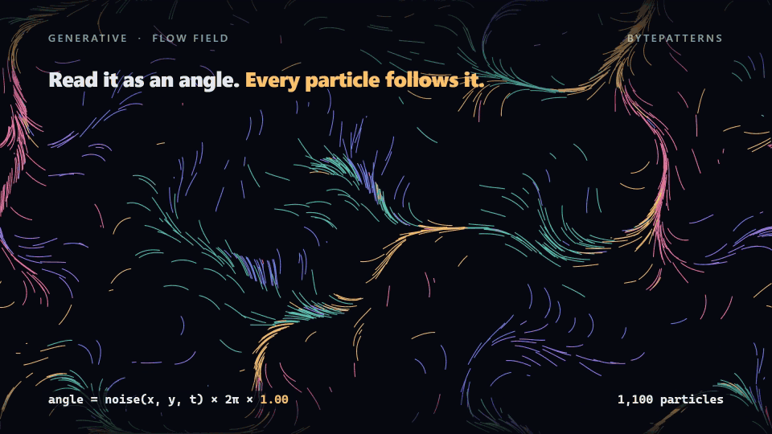</a>
<br><b>34 · Flow Field</b> <sub>26 s</sub>
<br>Generative: 3D Perlin noise read as an angle, first as a field of arrows, then followed by 1,100 particles that bunch into rivers; the angle multiplier eases from 1 to 3 and the rivers curl into eddies. 849,200 particle steps, simulated once and drawn from the log.
<br><sub><a href="https://bytepatterns.github.io/motion-lab/projects/34-flow-field/">open in browser</a> · <a href="out/34-flow-field.png">still</a> · <a href="projects/34-flow-field/index.html">source</a></sub>
</td>
<td width="28%" valign="top">
<a href="https://bytepatterns.github.io/motion-lab/projects/34-flow-field/?variant=vertical">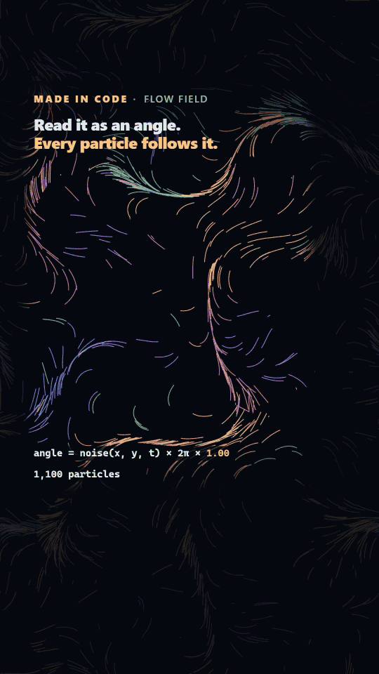</a>
<br><sub>9:16 · 18 s</sub>
<br><sub><a href="https://bytepatterns.github.io/motion-lab/projects/34-flow-field/?variant=vertical">open</a> · <a href="out/34-flow-field.vertical.png">still</a></sub>
</td>
</tr>
<tr>
<td width="72%" valign="top">
<a href="https://bytepatterns.github.io/motion-lab/projects/35-bead-sort/">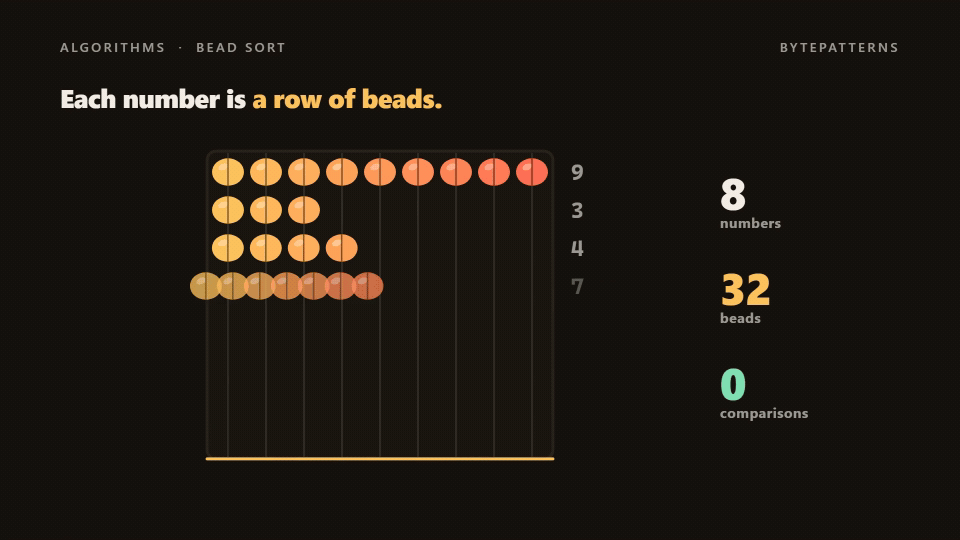</a>
<br><b>35 · Gravity Sort</b> <sub>23 s</sub>
<br>Bead sort: 8 numbers (9, 3, 4, 7, 2, 1, 3, 3) as rows of beads on an abacus fall down their rods under gravity and bounce, and the rows read 1, 2, 3, 3, 3, 4, 7, 9; then 14 numbers, 82 beads, in one drop. No comparisons: each bead only falls.
<br><sub><a href="https://bytepatterns.github.io/motion-lab/projects/35-bead-sort/">open in browser</a> · <a href="out/35-bead-sort.png">still</a> · <a href="projects/35-bead-sort/index.html">source</a></sub>
</td>
<td width="28%" valign="top">
<a href="https://bytepatterns.github.io/motion-lab/projects/35-bead-sort/?variant=vertical">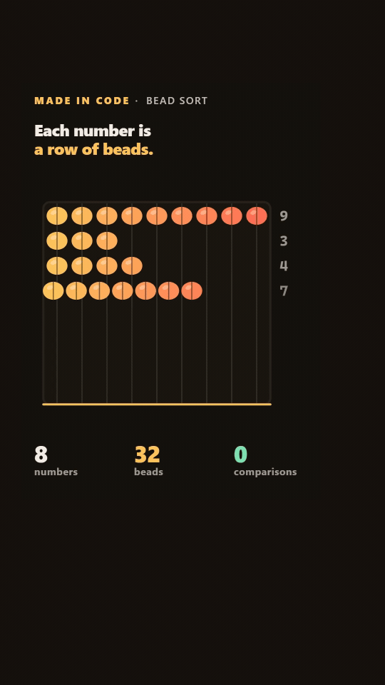</a>
<br><sub>9:16 · 15 s</sub>
<br><sub><a href="https://bytepatterns.github.io/motion-lab/projects/35-bead-sort/?variant=vertical">open</a> · <a href="out/35-bead-sort.vertical.png">still</a></sub>
</td>
</tr>
<tr>
<td width="72%" valign="top">
<a href="https://bytepatterns.github.io/motion-lab/projects/36-quicksort-partition/">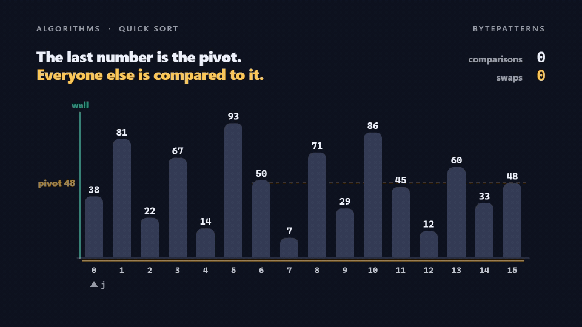</a>
<br><b>36 · Quick Sort: The Partition Dance</b> <sub>30 s</sub>
<br>A real quick sort of 16 numbers with the Lomuto partition, danced out: the last number of each range is the pivot, every smaller number hops to the left of a moving wall, and the pivot jumps into its final place. 11 pivots, 42 comparisons and 24 swaps, one tick per swap.
<br><sub><a href="https://bytepatterns.github.io/motion-lab/projects/36-quicksort-partition/">open in browser</a> · <a href="out/36-quicksort-partition.png">still</a> · <a href="projects/36-quicksort-partition/index.html">source</a></sub>
</td>
<td width="28%" valign="top">
<a href="https://bytepatterns.github.io/motion-lab/projects/36-quicksort-partition/?variant=vertical">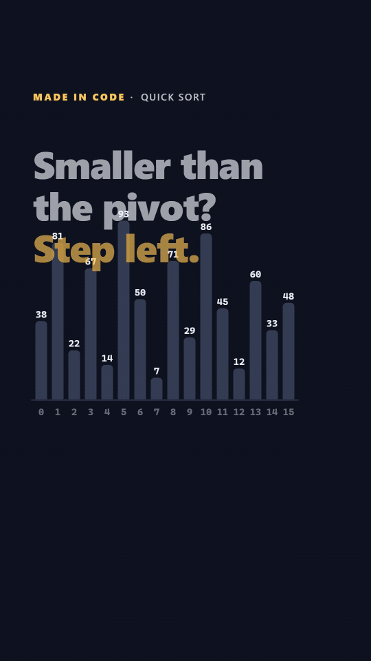</a>
<br><sub>9:16 · 19 s</sub>
<br><sub><a href="https://bytepatterns.github.io/motion-lab/projects/36-quicksort-partition/?variant=vertical">open</a> · <a href="out/36-quicksort-partition.vertical.png">still</a></sub>
</td>
</tr>
<tr>
<td width="72%" valign="top">
<a href="https://bytepatterns.github.io/motion-lab/projects/37-cdn-edge-cache/">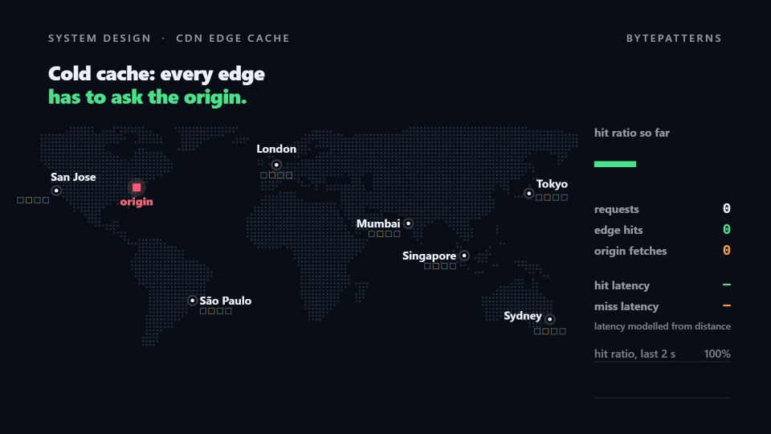</a>
<br><b>37 · CDN Edge Cache: Hit, Miss, TTL</b> <sub>29 s</sub>
<br>A simulated CDN on a dotted world map: 217 requests reach 7 edge caches; 130 are hits answered at the edge, 87 are misses fetched from one origin in Virginia, 44 of them because a copy's TTL had run out. Latency is modelled from great-circle distance: 7 ms on a hit, 129 ms on a miss.
<br><sub><a href="https://bytepatterns.github.io/motion-lab/projects/37-cdn-edge-cache/">open in browser</a> · <a href="out/37-cdn-edge-cache.png">still</a> · <a href="projects/37-cdn-edge-cache/index.html">source</a></sub>
</td>
<td width="28%" valign="top">
<a href="https://bytepatterns.github.io/motion-lab/projects/37-cdn-edge-cache/?variant=vertical">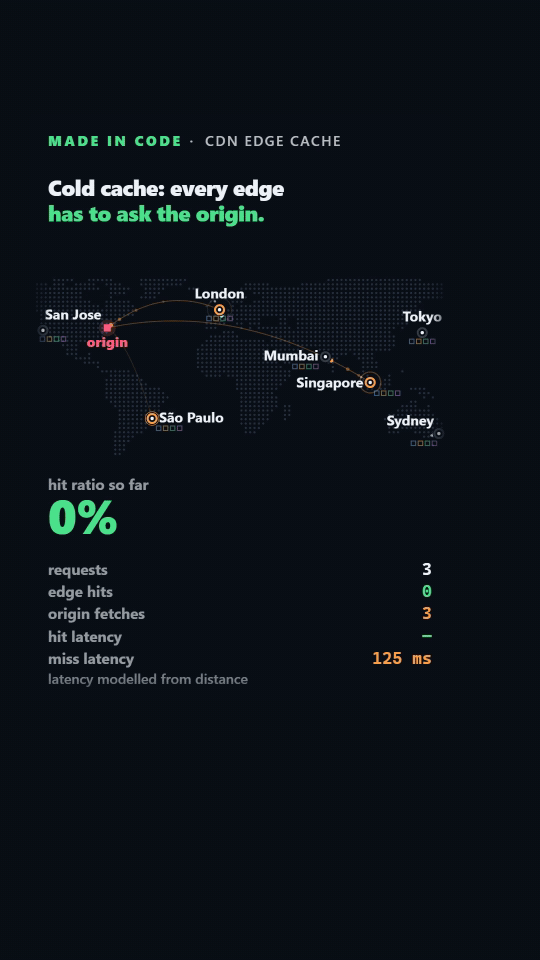</a>
<br><sub>9:16 · 19 s</sub>
<br><sub><a href="https://bytepatterns.github.io/motion-lab/projects/37-cdn-edge-cache/?variant=vertical">open</a> · <a href="out/37-cdn-edge-cache.vertical.png">still</a></sub>
</td>
</tr>
<tr>
<td width="72%" valign="top">
<a href="https://bytepatterns.github.io/motion-lab/projects/38-recursion/">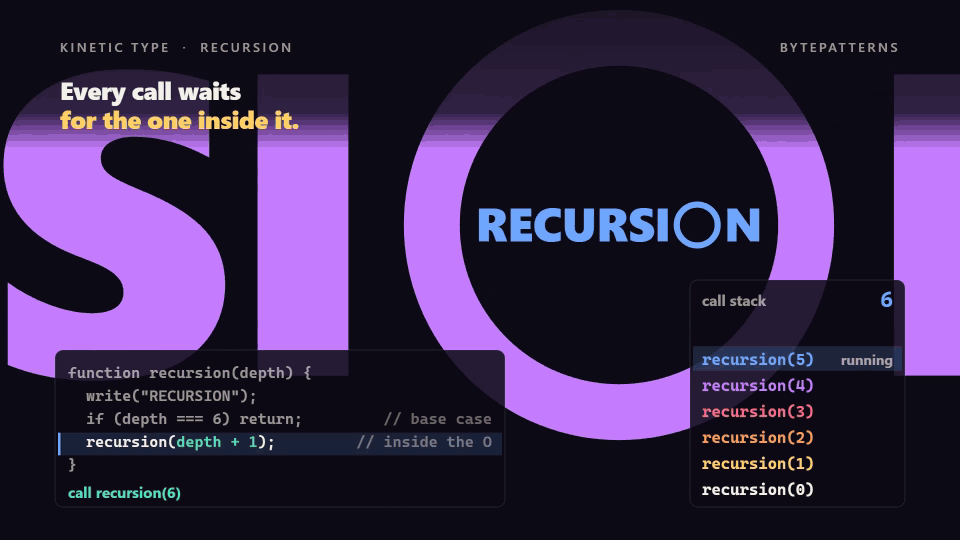</a>
<br><b>38 · Recursion, Written in Itself</b> <sub>26 s</sub>
<br>Kinetic type: the word RECURSION writes itself again inside its own O, 9.1 times smaller each time, 7 calls deep; the camera dives through every O while the call stack grows to depth 6, hits the base case and unwinds, innermost first.
<br><sub><a href="https://bytepatterns.github.io/motion-lab/projects/38-recursion/">open in browser</a> · <a href="out/38-recursion.png">still</a> · <a href="projects/38-recursion/index.html">source</a></sub>
</td>
<td width="28%" valign="top">
<a href="https://bytepatterns.github.io/motion-lab/projects/38-recursion/?variant=vertical">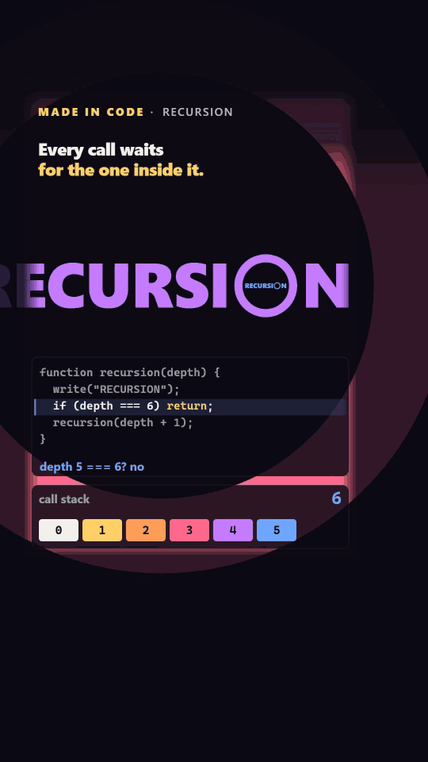</a>
<br><sub>9:16 · 19 s</sub>
<br><sub><a href="https://bytepatterns.github.io/motion-lab/projects/38-recursion/?variant=vertical">open</a> · <a href="out/38-recursion.vertical.png">still</a></sub>
</td>
</tr>
<tr>
<td width="72%" valign="top">
<a href="https://bytepatterns.github.io/motion-lab/projects/39-lloyd-relaxation/">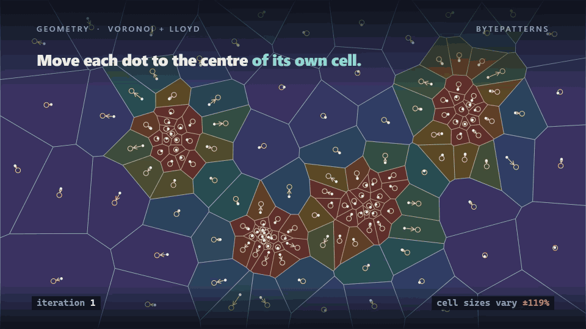</a>
<br><b>39 · Lloyd's Relaxation</b> <sub>26 s</sub>
<br>Generative geometry: 150 clumped random dots own the Voronoi cells around them; 100 times over, every dot moves to the centroid of its own cell and the cells are rebuilt, until the cell sizes, which varied by ±137%, vary by only ±11%. Each cell is clipped exactly from the frame by its neighbours' bisectors.
<br><sub><a href="https://bytepatterns.github.io/motion-lab/projects/39-lloyd-relaxation/">open in browser</a> · <a href="out/39-lloyd-relaxation.png">still</a> · <a href="projects/39-lloyd-relaxation/index.html">source</a></sub>
</td>
<td width="28%" valign="top">
<a href="https://bytepatterns.github.io/motion-lab/projects/39-lloyd-relaxation/?variant=vertical">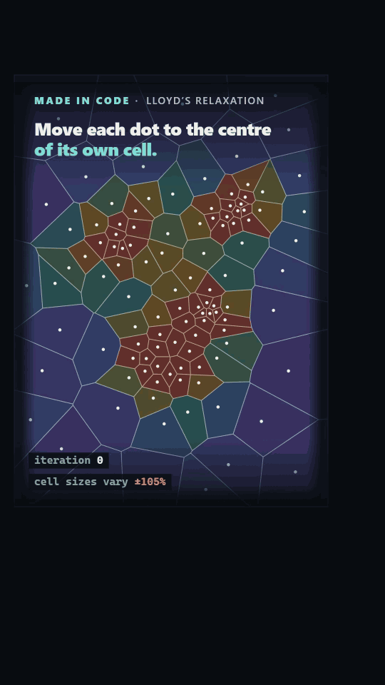</a>
<br><sub>9:16 · 19 s</sub>
<br><sub><a href="https://bytepatterns.github.io/motion-lab/projects/39-lloyd-relaxation/?variant=vertical">open</a> · <a href="out/39-lloyd-relaxation.vertical.png">still</a></sub>
</td>
</tr>
<tr>
<td width="72%" valign="top">
<a href="https://bytepatterns.github.io/motion-lab/projects/40-ripple-tank/">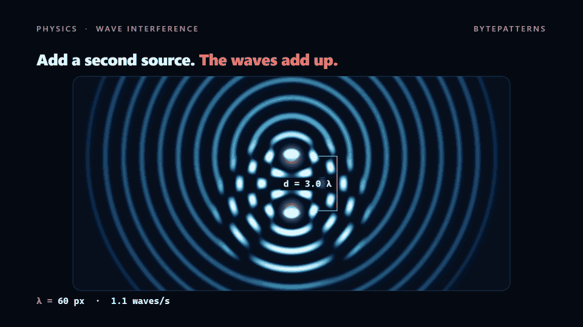</a>
<br><b>40 · Ripple Tank</b> <sub>26 s</sub>
<br>Wave interference computed pixel by pixel: one source makes circles, a second makes an interference pattern, and the lines where crest always meets trough stay still. Pulling the sources from 3λ to 6λ apart takes them from 6 to 12 still lines (2·⌊d/λ + ½⌋), drawn exactly as hyperbolas; the two source tones beat 1.5 times a second.
<br><sub><a href="https://bytepatterns.github.io/motion-lab/projects/40-ripple-tank/">open in browser</a> · <a href="out/40-ripple-tank.png">still</a> · <a href="projects/40-ripple-tank/index.html">source</a></sub>
</td>
<td width="28%" valign="top">
<a href="https://bytepatterns.github.io/motion-lab/projects/40-ripple-tank/?variant=vertical">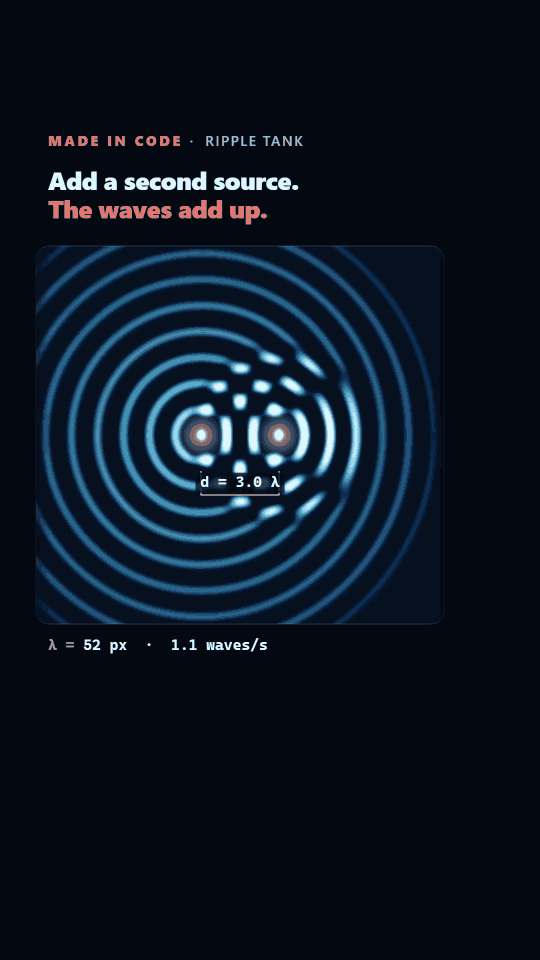</a>
<br><sub>9:16 · 19 s</sub>
<br><sub><a href="https://bytepatterns.github.io/motion-lab/projects/40-ripple-tank/?variant=vertical">open</a> · <a href="out/40-ripple-tank.vertical.png">still</a></sub>
</td>
</tr>
<tr>
<td width="72%" valign="top">
<a href="https://bytepatterns.github.io/motion-lab/projects/41-l-system-plant/">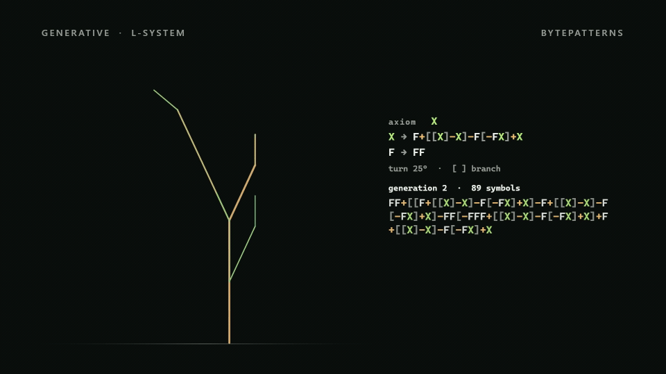</a>
<br><b>41 · Grown from a Rule</b> <sub>26 s</sub>
<br>An L-system, grown for real: the letter X is rewritten six times by X → F+[[X]−X]−F[−FX]+X and F → FF into 25,159 symbols, and a turtle reads them as 6,048 pen strokes, 25° turns and bracketed branches, generation by generation, until the plant sways and 4,096 buds open.
<br><sub><a href="https://bytepatterns.github.io/motion-lab/projects/41-l-system-plant/">open in browser</a> · <a href="out/41-l-system-plant.png">still</a> · <a href="projects/41-l-system-plant/index.html">source</a></sub>
</td>
<td width="28%" valign="top">
<a href="https://bytepatterns.github.io/motion-lab/projects/41-l-system-plant/?variant=vertical">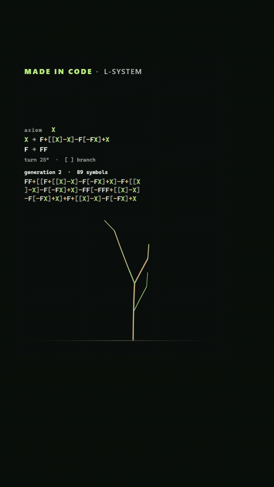</a>
<br><sub>9:16 · 19 s</sub>
<br><sub><a href="https://bytepatterns.github.io/motion-lab/projects/41-l-system-plant/?variant=vertical">open</a> · <a href="out/41-l-system-plant.vertical.png">still</a></sub>
</td>
</tr>
<tr>
<td width="72%" valign="top">
<a href="https://bytepatterns.github.io/motion-lab/projects/42-langtons-ant/">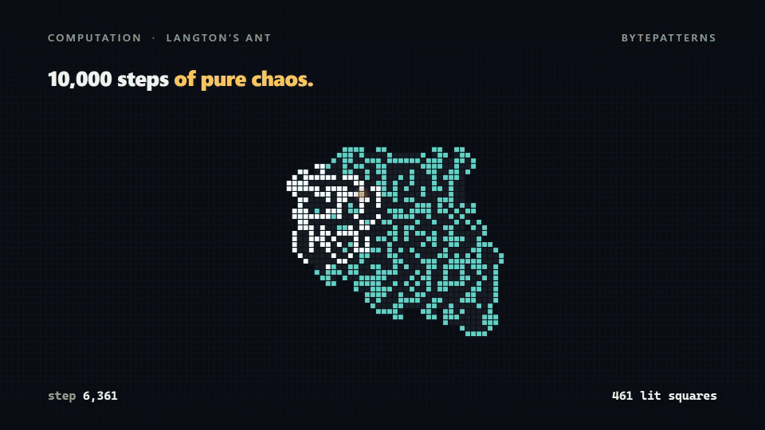</a>
<br><b>42 · Langton's Ant</b> <sub>27 s</sub>
<br>Langton's ant, run for real on a grid: turn right on an unlit square, left on a lit one, flip it, step. 9,977 steps of chaos, then a highway that repeats every 104 steps and moves 2 squares diagonally, found in the log rather than typed in; one tick per step, one beat per cycle.
<br><sub><a href="https://bytepatterns.github.io/motion-lab/projects/42-langtons-ant/">open in browser</a> · <a href="out/42-langtons-ant.png">still</a> · <a href="projects/42-langtons-ant/index.html">source</a></sub>
</td>
<td width="28%" valign="top">
<a href="https://bytepatterns.github.io/motion-lab/projects/42-langtons-ant/?variant=vertical">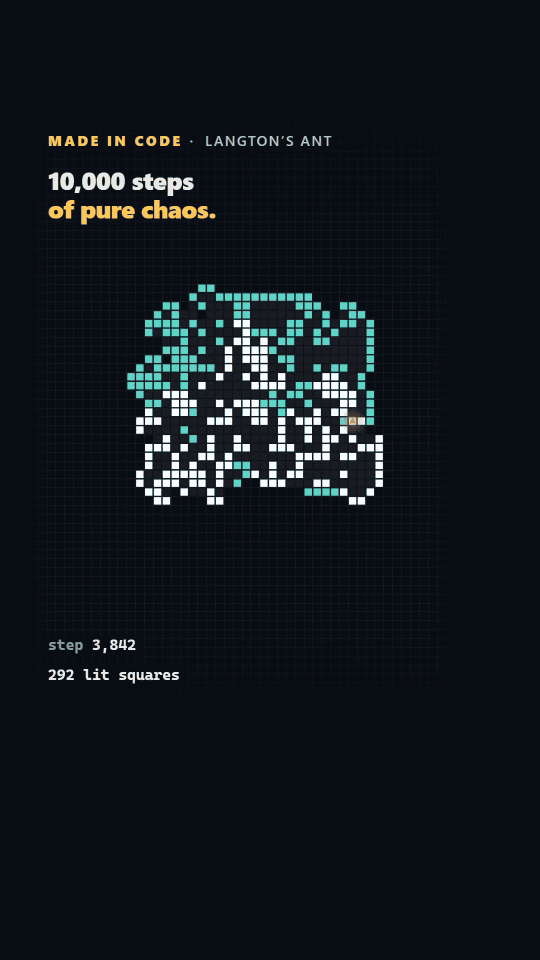</a>
<br><sub>9:16 · 19 s</sub>
<br><sub><a href="https://bytepatterns.github.io/motion-lab/projects/42-langtons-ant/?variant=vertical">open</a> · <a href="out/42-langtons-ant.vertical.png">still</a></sub>
</td>
</tr>
<tr>
<td width="72%" valign="top">
<a href="https://bytepatterns.github.io/motion-lab/projects/43-hilbert-curve/">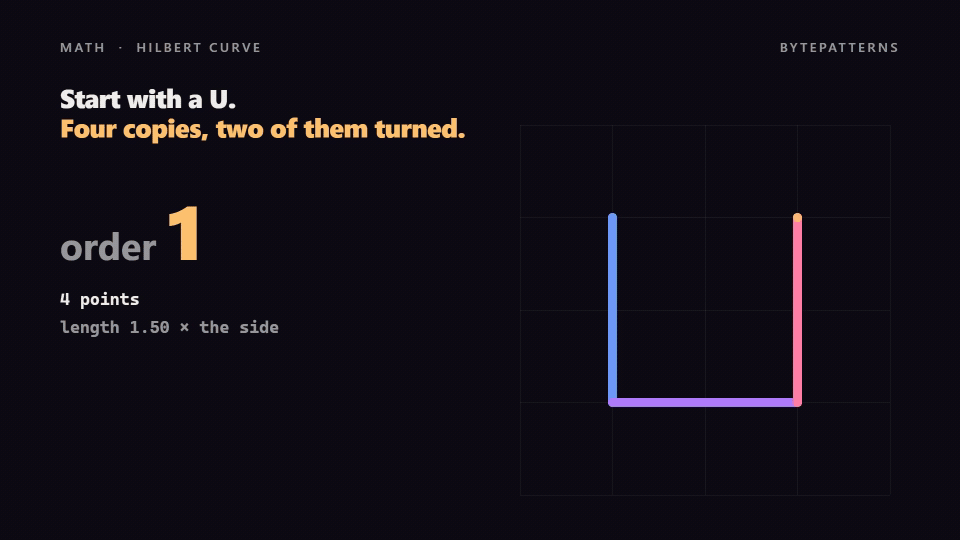</a>
<br><b>43 · One Line Fills the Square</b> <sub>26 s</sub>
<br>The Hilbert curve from order 1 to order 7: a U becomes four turned copies of itself, again and again, each new point growing out of its parent, until one line of 16,384 points and length 127.99 fills the square without crossing itself; a window of 819 points in a row slides along it and always lights a compact patch.
<br><sub><a href="https://bytepatterns.github.io/motion-lab/projects/43-hilbert-curve/">open in browser</a> · <a href="out/43-hilbert-curve.png">still</a> · <a href="projects/43-hilbert-curve/index.html">source</a></sub>
</td>
<td width="28%" valign="top">
<a href="https://bytepatterns.github.io/motion-lab/projects/43-hilbert-curve/?variant=vertical">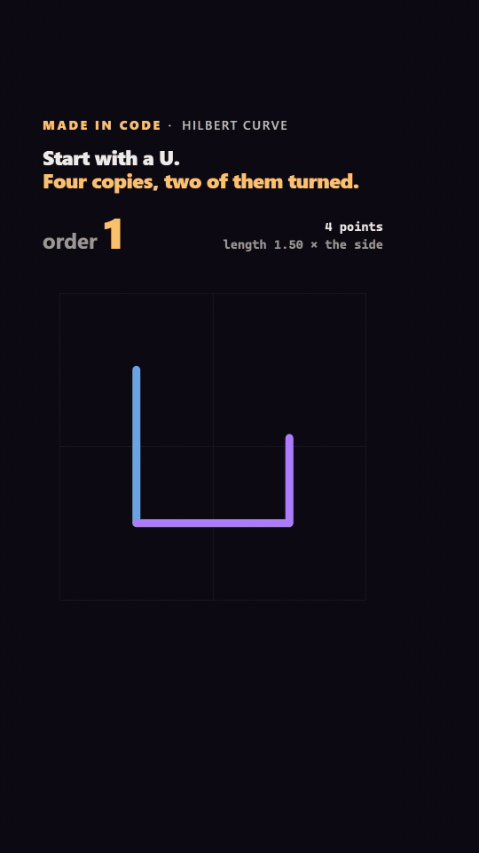</a>
<br><sub>9:16 · 19 s</sub>
<br><sub><a href="https://bytepatterns.github.io/motion-lab/projects/43-hilbert-curve/?variant=vertical">open</a> · <a href="out/43-hilbert-curve.vertical.png">still</a></sub>
</td>
</tr>
<tr>
<td width="72%" valign="top">
<a href="https://bytepatterns.github.io/motion-lab/projects/44-lru-cache/">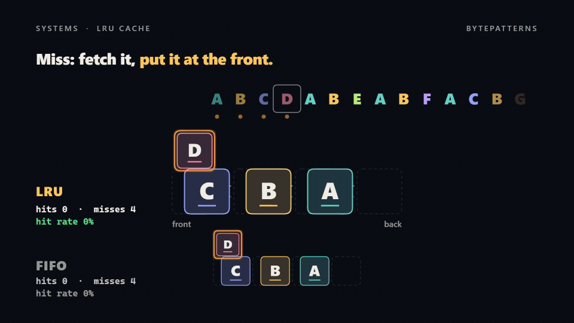</a>
<br><b>44 · Least Recently Used</b> <sub>27 s</sub>
<br>An LRU cache with 4 slots serves 30 requests: a hit moves its entry to the front, a miss puts the new entry there and, once the cache is full, evicts the one at the back. Request 7 is the first eviction; by the end LRU has 15 hits (50%), while a FIFO cache of the same size on the same requests has 8 (27%), because it evicts by arrival, hot or not.
<br><sub><a href="https://bytepatterns.github.io/motion-lab/projects/44-lru-cache/">open in browser</a> · <a href="out/44-lru-cache.png">still</a> · <a href="projects/44-lru-cache/index.html">source</a></sub>
</td>
<td width="28%" valign="top">
<a href="https://bytepatterns.github.io/motion-lab/projects/44-lru-cache/?variant=vertical">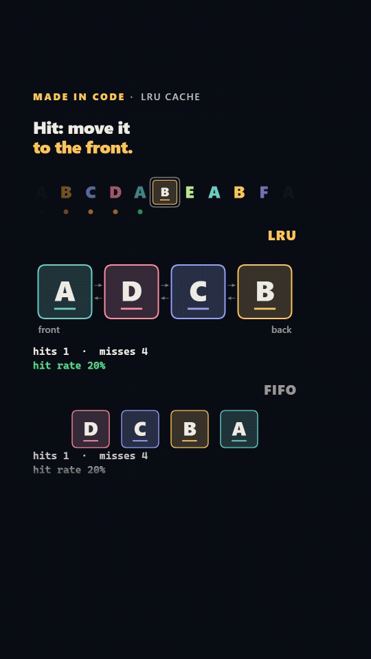</a>
<br><sub>9:16 · 19 s</sub>
<br><sub><a href="https://bytepatterns.github.io/motion-lab/projects/44-lru-cache/?variant=vertical">open</a> · <a href="out/44-lru-cache.vertical.png">still</a></sub>
</td>
</tr>
<tr>
<td width="72%" valign="top">
<a href="https://bytepatterns.github.io/motion-lab/projects/45-b-tree-splits/">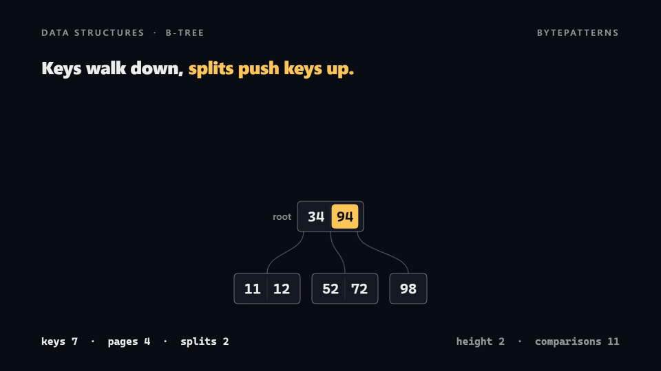</a>
<br><b>45 · B-Tree Page Splits</b> <sub>27 s</sub>
<br>A real B-tree with pages of at most 3 keys takes 18 shuffled inserts: each key walks down from the root to a leaf (58 comparisons in all), a page that reaches 4 keys splits and pushes its middle key up, 9 splits in all, 2 of them at the root, so the tree grows at the top to 3 levels and 12 pages with every leaf at the same depth; with 500-key pages, 3 levels would hold 125,751,500 keys.
<br><sub><a href="https://bytepatterns.github.io/motion-lab/projects/45-b-tree-splits/">open in browser</a> · <a href="out/45-b-tree-splits.png">still</a> · <a href="projects/45-b-tree-splits/index.html">source</a></sub>
</td>
<td width="28%" valign="top">
<a href="https://bytepatterns.github.io/motion-lab/projects/45-b-tree-splits/?variant=vertical">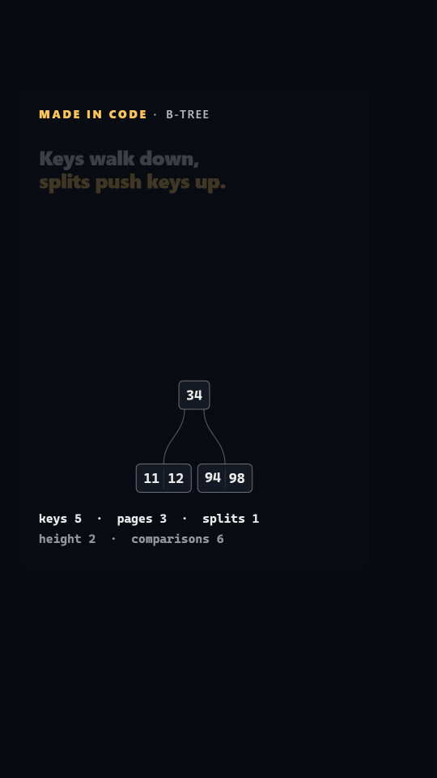</a>
<br><sub>9:16 · 19 s</sub>
<br><sub><a href="https://bytepatterns.github.io/motion-lab/projects/45-b-tree-splits/?variant=vertical">open</a> · <a href="out/45-b-tree-splits.vertical.png">still</a></sub>
</td>
</tr>
<tr>
<td width="72%" valign="top">
<a href="https://bytepatterns.github.io/motion-lab/projects/46-bresenham-line/">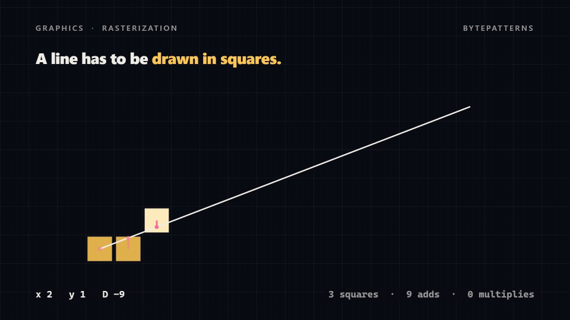</a>
<br><b>46 · Bresenham's Line</b> <sub>26 s</sub>
<br>Bresenham's line algorithm draws a line from (0, 0) to (13, 5) as 14 squares, each chosen by a running integer error (D += 10; when D &gt; 0, step up and D −= 26); then 24 lines in every direction, a radius-12 midpoint circle computed for one eighth (9 squares) and mirrored into 68, and 30 rings as the camera pulls back: 8,507 squares for 6,746 integer adds and 0 multiplies, all counted as they run.
<br><sub><a href="https://bytepatterns.github.io/motion-lab/projects/46-bresenham-line/">open in browser</a> · <a href="out/46-bresenham-line.png">still</a> · <a href="projects/46-bresenham-line/index.html">source</a></sub>
</td>
<td width="28%" valign="top">
<a href="https://bytepatterns.github.io/motion-lab/projects/46-bresenham-line/?variant=vertical">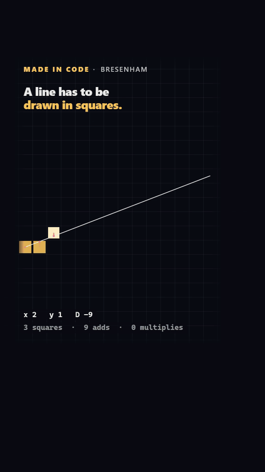</a>
<br><sub>9:16 · 19 s</sub>
<br><sub><a href="https://bytepatterns.github.io/motion-lab/projects/46-bresenham-line/?variant=vertical">open</a> · <a href="out/46-bresenham-line.vertical.png">still</a></sub>
</td>
</tr>
<tr>
<td width="72%" valign="top">
<a href="https://bytepatterns.github.io/motion-lab/projects/47-contour-lines/">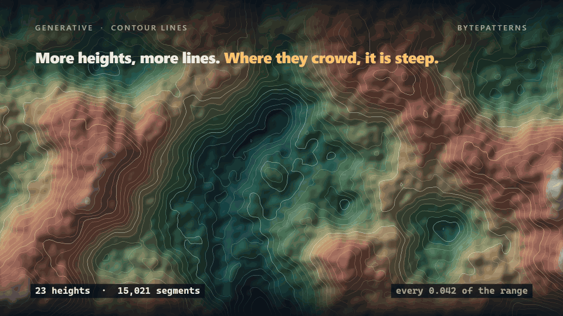</a>
<br><b>47 · Contour Lines</b> <sub>27 s</sub>
<br>Generative: seeded Perlin noise becomes terrain on a 240 × 135 grid of squares; marching squares traces one height (1,226 segments), then 23 of them (15,021 segments) over a shaded relief tint; then a sea rises from 0.08 to 0.62, its coastline traced every frame and the land flood-filled into islands: at most 10, at sea level 0.59.
<br><sub><a href="https://bytepatterns.github.io/motion-lab/projects/47-contour-lines/">open in browser</a> · <a href="out/47-contour-lines.png">still</a> · <a href="projects/47-contour-lines/index.html">source</a></sub>
</td>
<td width="28%" valign="top">
<a href="https://bytepatterns.github.io/motion-lab/projects/47-contour-lines/?variant=vertical">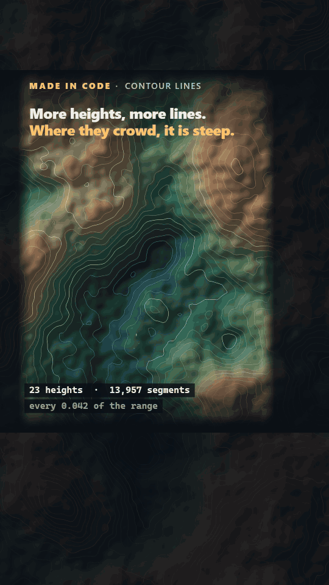</a>
<br><sub>9:16 · 19 s</sub>
<br><sub><a href="https://bytepatterns.github.io/motion-lab/projects/47-contour-lines/?variant=vertical">open</a> · <a href="out/47-contour-lines.vertical.png">still</a></sub>
</td>
</tr>
<tr>
<td width="72%" valign="top">
<a href="https://bytepatterns.github.io/motion-lab/projects/48-three-body-eight/">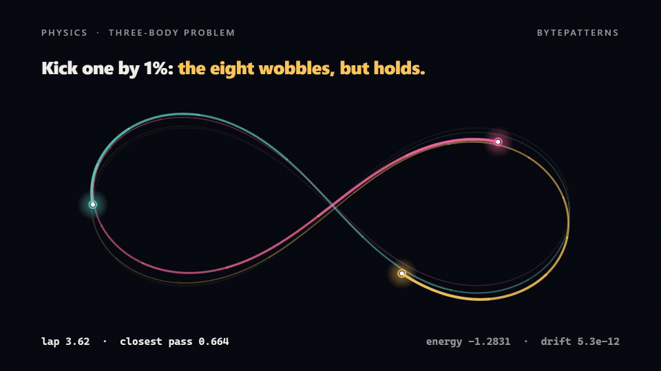</a>
<br><b>48 · Three Bodies, One Eight</b> <sub>27 s</sub>
<br>Three equal masses under Newton's gravity share one figure-eight path, each a third of a lap behind the next (to within 6.7e-8); the simulation measures one lap as 6.3259 time units and holds energy to a drift of 7.3e-12. A 1% kick to one body only makes the eight wobble (closest pass 0.691 before, 0.664 after); a 30% kick breaks it into a chaotic tangle with passes as close as 0.035. Each body's tone follows its own speed.
<br><sub><a href="https://bytepatterns.github.io/motion-lab/projects/48-three-body-eight/">open in browser</a> · <a href="out/48-three-body-eight.png">still</a> · <a href="projects/48-three-body-eight/index.html">source</a></sub>
</td>
<td width="28%" valign="top">
<a href="https://bytepatterns.github.io/motion-lab/projects/48-three-body-eight/?variant=vertical">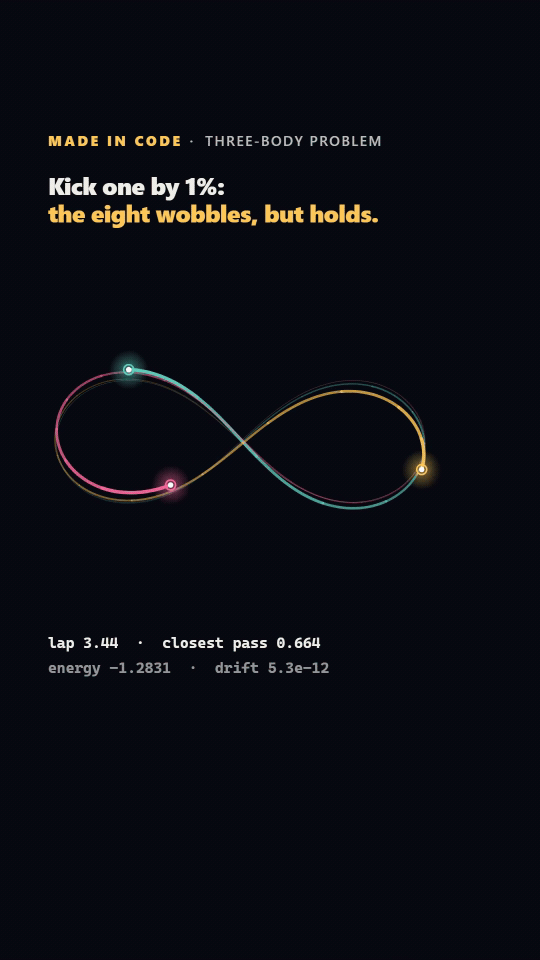</a>
<br><sub>9:16 · 19 s</sub>
<br><sub><a href="https://bytepatterns.github.io/motion-lab/projects/48-three-body-eight/?variant=vertical">open</a> · <a href="out/48-three-body-eight.vertical.png">still</a></sub>
</td>
</tr>
<tr>
<td width="72%" valign="top">
<a href="https://bytepatterns.github.io/motion-lab/projects/49-huffman-coding/">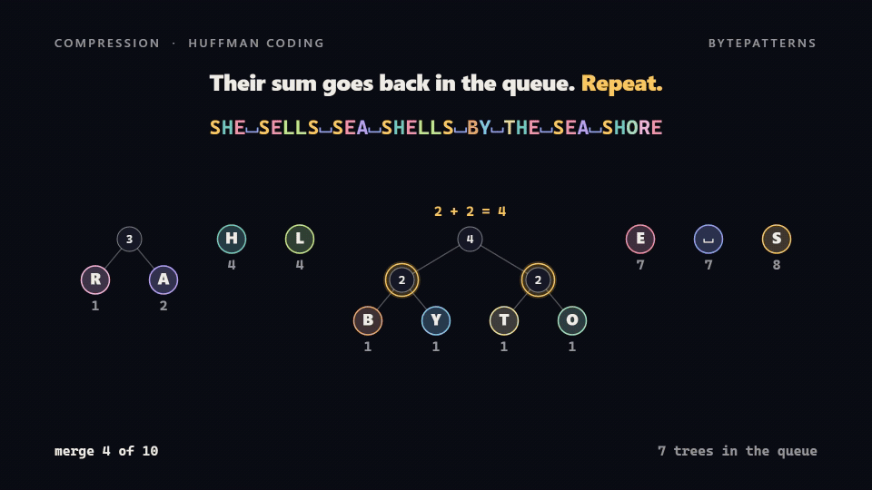</a>
<br><b>49 · Huffman Coding</b> <sub>27 s</sub>
<br>The sentence &quot;SHE SELLS SEA SHELLS BY THE SEA SHORE&quot; is counted into 11 symbols, queued rarest first and joined two at a time in 10 merges into one tree whose paths become codes of 2 to 5 bits, which spell its 37 letters in 114 bits instead of 296 in 8-bit ASCII or 148 in a fixed 4-bit code (entropy bound 111.4).
<br><sub><a href="https://bytepatterns.github.io/motion-lab/projects/49-huffman-coding/">open in browser</a> · <a href="out/49-huffman-coding.png">still</a> · <a href="projects/49-huffman-coding/index.html">source</a></sub>
</td>
<td width="28%" valign="top">
<a href="https://bytepatterns.github.io/motion-lab/projects/49-huffman-coding/?variant=vertical">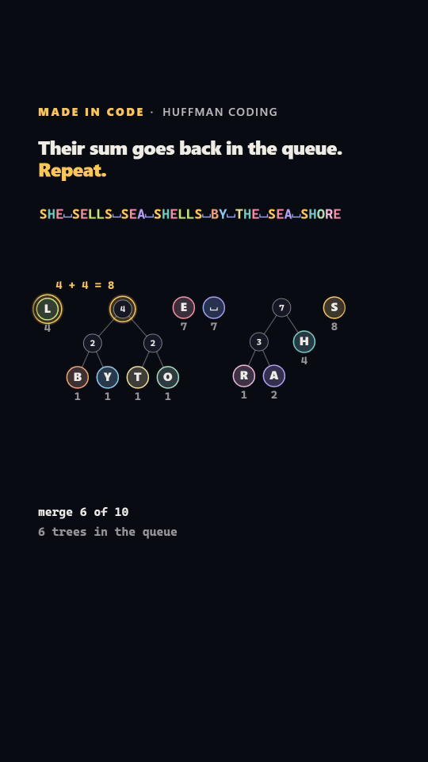</a>
<br><sub>9:16 · 20 s</sub>
<br><sub><a href="https://bytepatterns.github.io/motion-lab/projects/49-huffman-coding/?variant=vertical">open</a> · <a href="out/49-huffman-coding.vertical.png">still</a></sub>
</td>
</tr>
<tr>
<td width="72%" valign="top">
<a href="https://bytepatterns.github.io/motion-lab/projects/50-kruskal-mst/">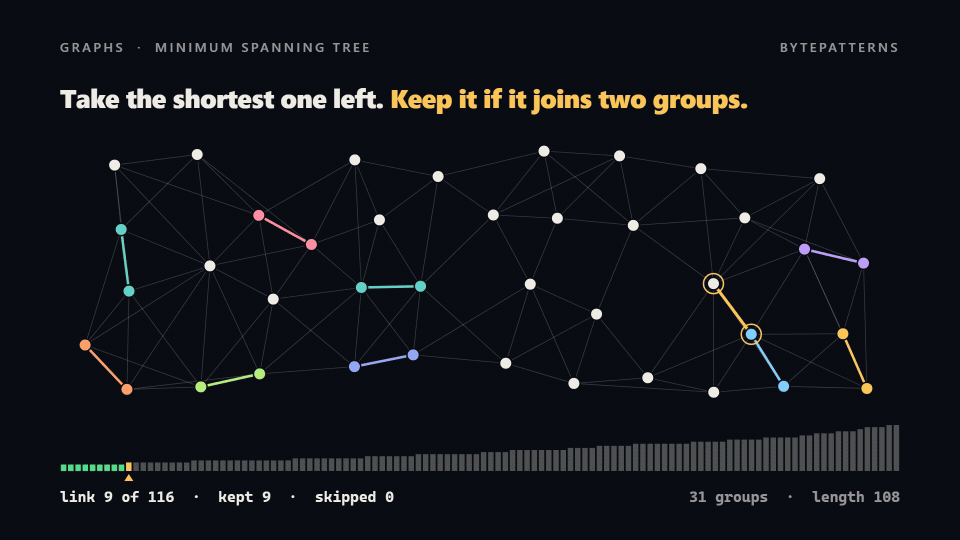</a>
<br><b>50 · Kruskal’s Spanning Tree</b> <sub>27 s</sub>
<br>40 points, each linked to its 5 nearest neighbours (116 links, total length 2,179): Kruskal's algorithm takes the links shortest first, keeps one only when union-find says it joins two groups and skips the 12 that would close a loop, stopping after 51 links with a spanning tree of 39 links and length 531, 24% of the whole.
<br><sub><a href="https://bytepatterns.github.io/motion-lab/projects/50-kruskal-mst/">open in browser</a> · <a href="out/50-kruskal-mst.png">still</a> · <a href="projects/50-kruskal-mst/index.html">source</a></sub>
</td>
<td width="28%" valign="top">
<a href="https://bytepatterns.github.io/motion-lab/projects/50-kruskal-mst/?variant=vertical">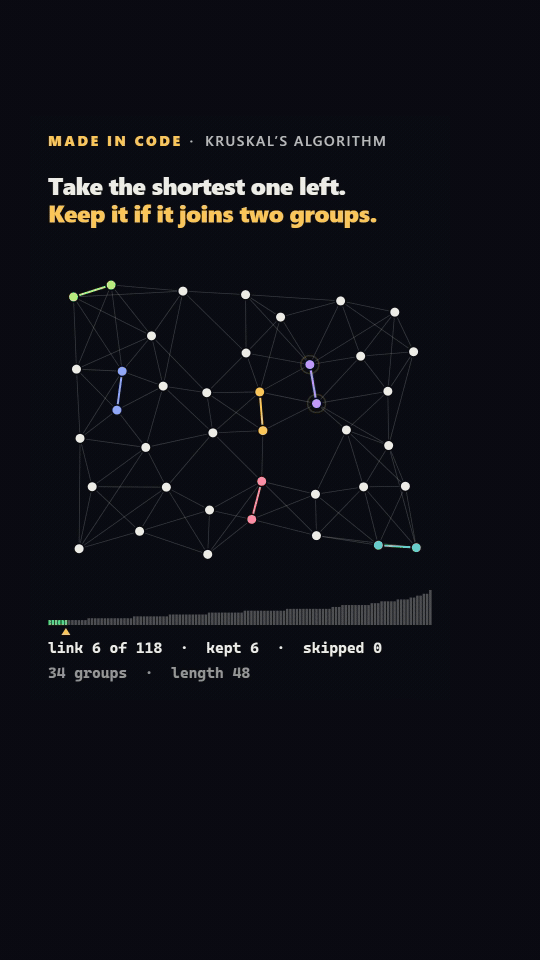</a>
<br><sub>9:16 · 20 s</sub>
<br><sub><a href="https://bytepatterns.github.io/motion-lab/projects/50-kruskal-mst/?variant=vertical">open</a> · <a href="out/50-kruskal-mst.vertical.png">still</a></sub>
</td>
</tr>
<tr>
<td width="72%" valign="top">
<a href="https://bytepatterns.github.io/motion-lab/projects/51-raft-election/">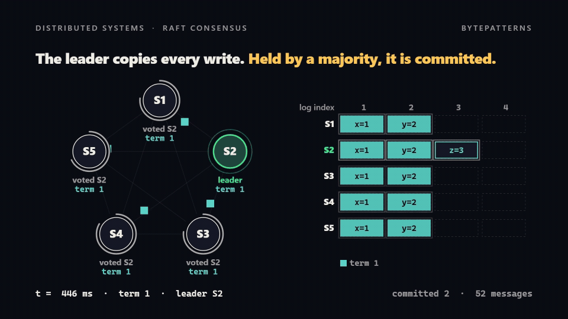</a>
<br><b>51 · Raft: Losing the Leader</b> <sub>27 s</sub>
<br>Five servers run Raft for 1273 simulated ms: S2 wins term 1 with 3 of 5 votes and commits 3 writes, crashes holding x=9 unsent, S4 and S3 split the vote in term 2, S5 wins term 3 after 387 ms without a leader, and when S2 returns its uncommitted x=9 is overwritten, leaving 4 committed writes on all 5 logs after 147 messages.
<br><sub><a href="https://bytepatterns.github.io/motion-lab/projects/51-raft-election/">open in browser</a> · <a href="out/51-raft-election.png">still</a> · <a href="projects/51-raft-election/index.html">source</a></sub>
</td>
<td width="28%" valign="top">
<a href="https://bytepatterns.github.io/motion-lab/projects/51-raft-election/?variant=vertical">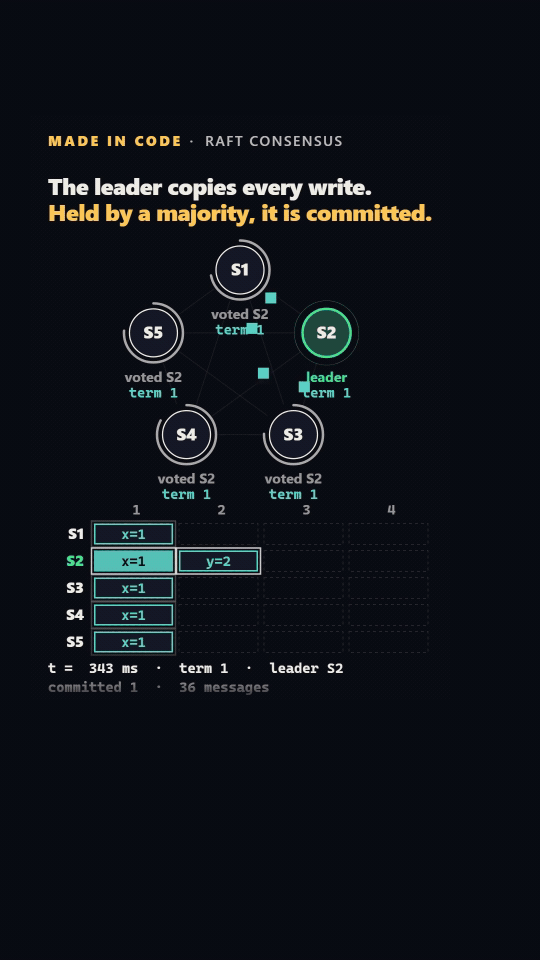</a>
<br><sub>9:16 · 20 s</sub>
<br><sub><a href="https://bytepatterns.github.io/motion-lab/projects/51-raft-election/?variant=vertical">open</a> · <a href="out/51-raft-election.vertical.png">still</a></sub>
</td>
</tr>
<tr>
<td width="72%" valign="top">
<a href="https://bytepatterns.github.io/motion-lab/projects/52-chaikin-corners/">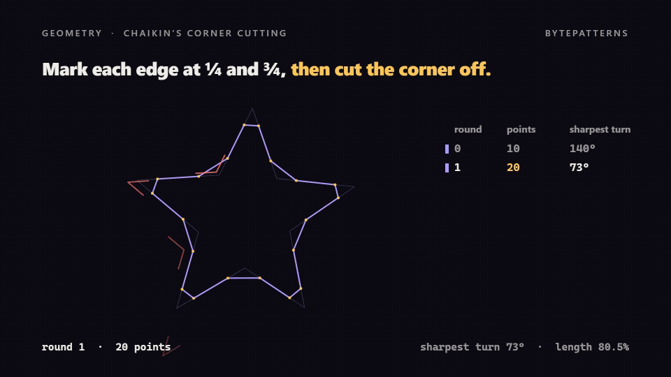</a>
<br><b>52 · Cut Every Corner</b> <sub>27 s</sub>
<br>Chaikin's algorithm cuts every corner of a 5-pointed star at ¼ and ¾ of each edge, 6 times, doubling it to 640 points while the sharpest turn falls from 140° to 5°, until it traces the smooth quadratic B-spline of the first corners, where pulling one corner out moves only 190 of the 640 points.
<br><sub><a href="https://bytepatterns.github.io/motion-lab/projects/52-chaikin-corners/">open in browser</a> · <a href="out/52-chaikin-corners.png">still</a> · <a href="projects/52-chaikin-corners/index.html">source</a></sub>
</td>
<td width="28%" valign="top">
<a href="https://bytepatterns.github.io/motion-lab/projects/52-chaikin-corners/?variant=vertical">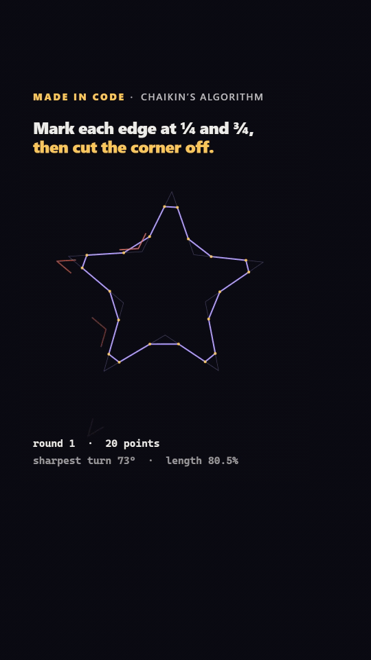</a>
<br><sub>9:16 · 20 s</sub>
<br><sub><a href="https://bytepatterns.github.io/motion-lab/projects/52-chaikin-corners/?variant=vertical">open</a> · <a href="out/52-chaikin-corners.vertical.png">still</a></sub>
</td>
</tr>
<tr>
<td width="72%" valign="top">
<a href="https://bytepatterns.github.io/motion-lab/projects/53-perlin-marble/">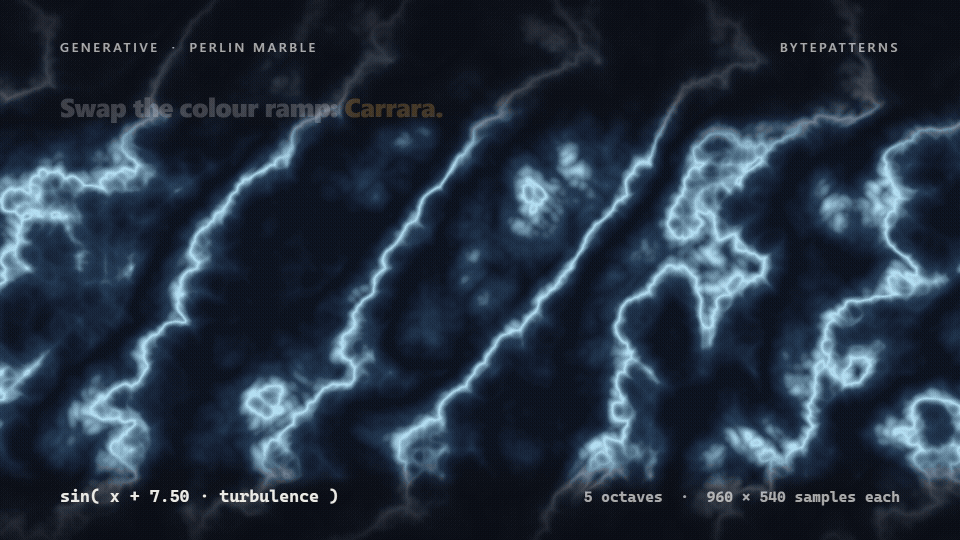</a>
<br><b>53 · Marble from One Sine</b> <sub>27 s</sub>
<br>Generative: sin(x + power · turbulence) on a 960 × 540 grid, where the turbulence sums 5 octaves of seeded Perlin noise (2,592,000 samples, each octave twice as fine and half as strong), bends straight stripes into marble veins as the power grows from 0 to 7.5 and the octaves from 1 to 5, while 3 colour ramps turn the same field into Night, Carrara, Nero stone.
<br><sub><a href="https://bytepatterns.github.io/motion-lab/projects/53-perlin-marble/">open in browser</a> · <a href="out/53-perlin-marble.png">still</a> · <a href="projects/53-perlin-marble/index.html">source</a></sub>
</td>
<td width="28%" valign="top">
<a href="https://bytepatterns.github.io/motion-lab/projects/53-perlin-marble/?variant=vertical">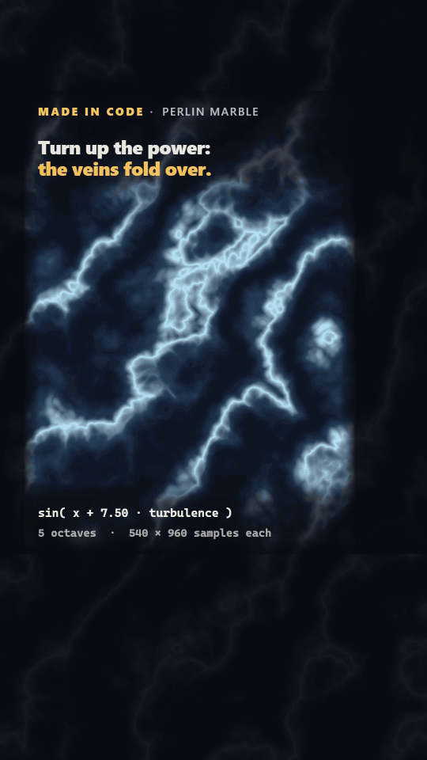</a>
<br><sub>9:16 · 20 s</sub>
<br><sub><a href="https://bytepatterns.github.io/motion-lab/projects/53-perlin-marble/?variant=vertical">open</a> · <a href="out/53-perlin-marble.vertical.png">still</a></sub>
</td>
</tr>
<tr>
<td width="72%" valign="top">
<a href="https://bytepatterns.github.io/motion-lab/projects/54-kd-tree-nearest/">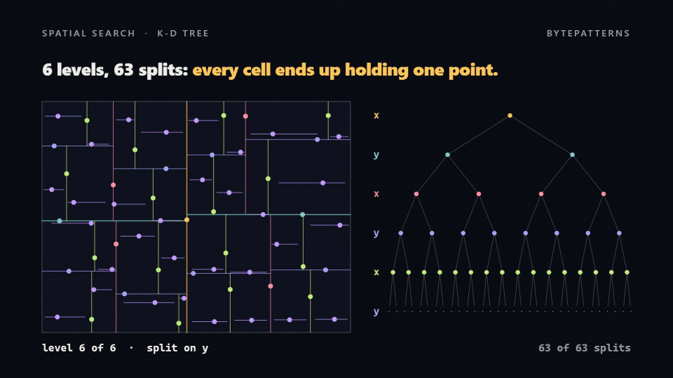</a>
<br><b>54 · k-d Tree: Nearest Neighbour</b> <sub>27 s</sub>
<br>63 points are split at the median, x then y, into a 6-level k-d tree, and 3 nearest-neighbour queries measure 9, 12, 8 distances instead of 63 each by skipping every side of a split line farther away than the best point so far, 160 of 189 points never looked at, with the same answers as brute force.
<br><sub><a href="https://bytepatterns.github.io/motion-lab/projects/54-kd-tree-nearest/">open in browser</a> · <a href="out/54-kd-tree-nearest.png">still</a> · <a href="projects/54-kd-tree-nearest/index.html">source</a></sub>
</td>
<td width="28%" valign="top">
<a href="https://bytepatterns.github.io/motion-lab/projects/54-kd-tree-nearest/?variant=vertical">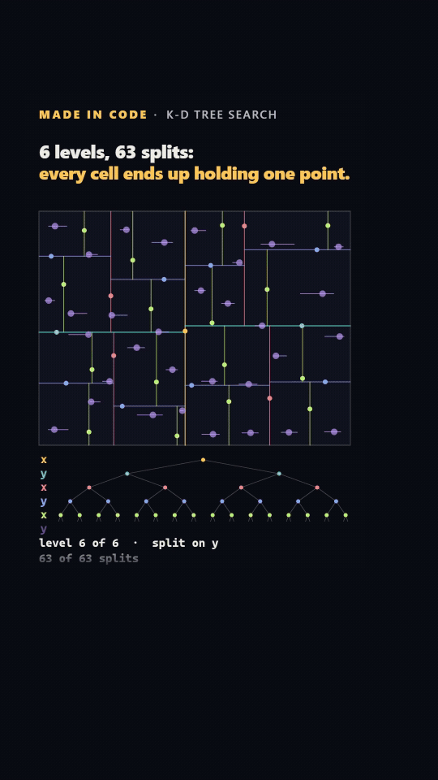</a>
<br><sub>9:16 · 20 s</sub>
<br><sub><a href="https://bytepatterns.github.io/motion-lab/projects/54-kd-tree-nearest/?variant=vertical">open</a> · <a href="out/54-kd-tree-nearest.vertical.png">still</a></sub>
</td>
</tr>
<tr>
<td width="72%" valign="top">
<a href="https://bytepatterns.github.io/motion-lab/projects/55-sliding-window-max/">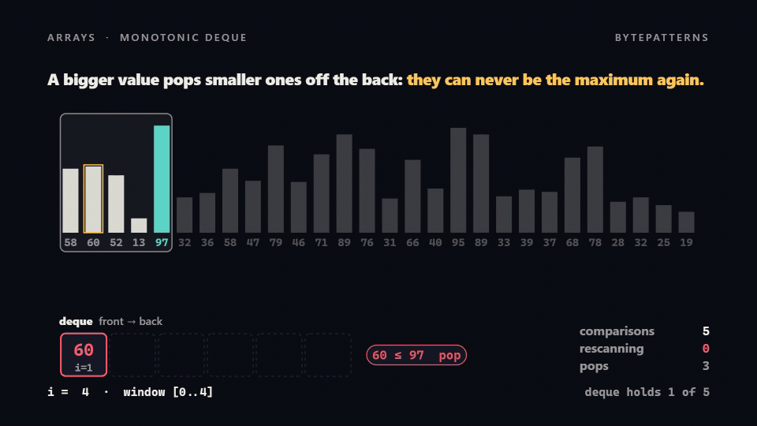</a>
<br><b>55 · Sliding Window Maximum</b> <sub>27 s</sub>
<br>A window of 6 slides across 28 numbers and a monotonic deque, never holding more than 4 of them, hands over all 23 window maxima from its front with 44 comparisons instead of the 115 that rescanning every window costs, each index pushed once and 24 popped (21 off the back by a bigger value, 3 off the front by the window), every maximum matching a rescan.
<br><sub><a href="https://bytepatterns.github.io/motion-lab/projects/55-sliding-window-max/">open in browser</a> · <a href="out/55-sliding-window-max.png">still</a> · <a href="projects/55-sliding-window-max/index.html">source</a></sub>
</td>
<td width="28%" valign="top">
<a href="https://bytepatterns.github.io/motion-lab/projects/55-sliding-window-max/?variant=vertical">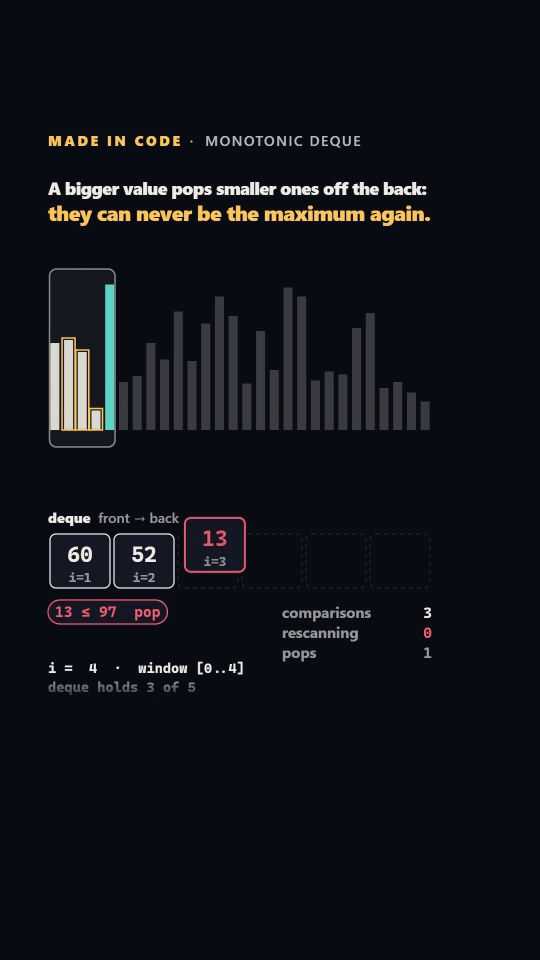</a>
<br><sub>9:16 · 20 s</sub>
<br><sub><a href="https://bytepatterns.github.io/motion-lab/projects/55-sliding-window-max/?variant=vertical">open</a> · <a href="out/55-sliding-window-max.vertical.png">still</a></sub>
</td>
</tr>
<tr>
<td width="72%" valign="top">
<a href="https://bytepatterns.github.io/motion-lab/projects/56-skip-list/">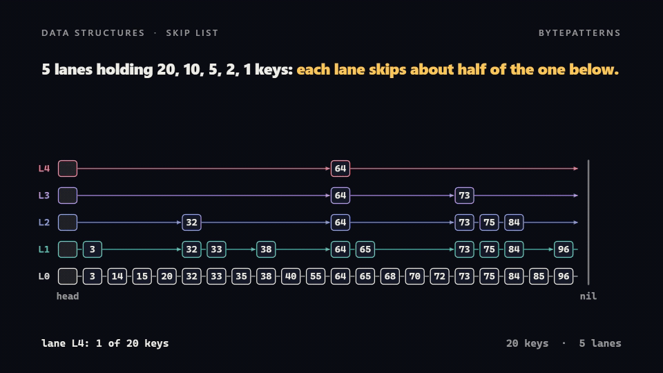</a>
<br><b>56 · Skip List: Express Lanes</b> <sub>26 s</sub>
<br>20 sorted keys flip coins into 5 lanes of 20, 10, 5, 2, 1 keys; finding 73 takes 9 comparisons against 16 for a scan of the bottom lane, inserting 47 walks the same way, flips heads, heads, tails for a height of 3 and is spliced into 3 lanes, and 79 is proved absent in 6 comparisons against 19.
<br><sub><a href="https://bytepatterns.github.io/motion-lab/projects/56-skip-list/">open in browser</a> · <a href="out/56-skip-list.png">still</a> · <a href="projects/56-skip-list/index.html">source</a></sub>
</td>
<td width="28%" valign="top">
<a href="https://bytepatterns.github.io/motion-lab/projects/56-skip-list/?variant=vertical">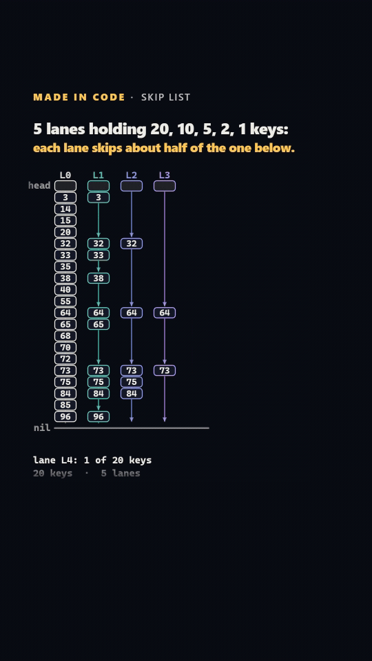</a>
<br><sub>9:16 · 20 s</sub>
<br><sub><a href="https://bytepatterns.github.io/motion-lab/projects/56-skip-list/?variant=vertical">open</a> · <a href="out/56-skip-list.vertical.png">still</a></sub>
</td>
</tr>
<tr>
<td width="72%" valign="top">
<a href="https://bytepatterns.github.io/motion-lab/projects/57-golden-angle/">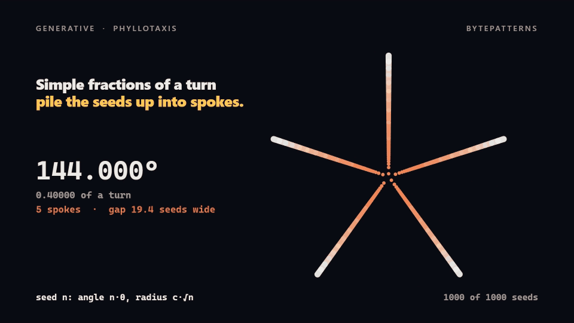</a>
<br><b>57 · The Golden Angle</b> <sub>27 s</sub>
<br>Generative: 1000 seeds at angle n·θ and radius c·√n form 2, 3, 5 spokes with gaps up to 33.7 seeds wide at 1/2, 1/3, 2/5 of a turn, pack evenly (widest gap 0.5 seeds) at the golden angle of 137.508°, where nearest neighbours sit 34, 55, 89 seeds apart and trace 34, 55, 89 spirals, and open to a 4.8-seed gap at 138.5°.
<br><sub><a href="https://bytepatterns.github.io/motion-lab/projects/57-golden-angle/">open in browser</a> · <a href="out/57-golden-angle.png">still</a> · <a href="projects/57-golden-angle/index.html">source</a></sub>
</td>
<td width="28%" valign="top">
<a href="https://bytepatterns.github.io/motion-lab/projects/57-golden-angle/?variant=vertical">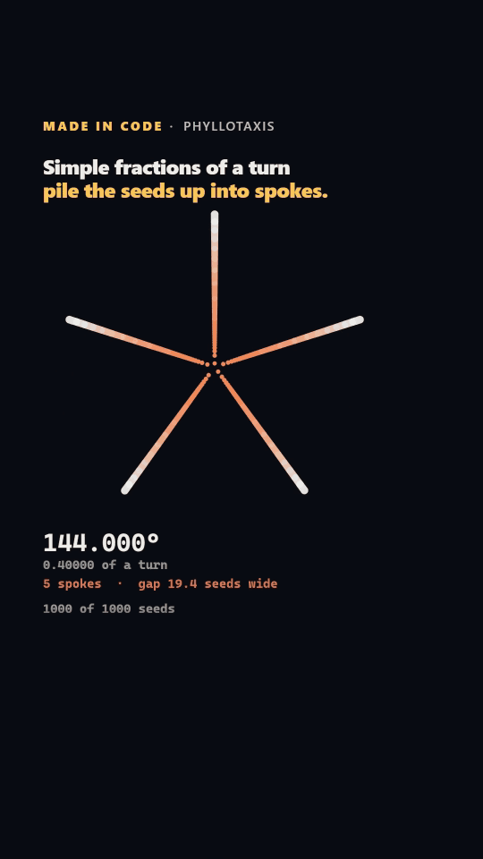</a>
<br><sub>9:16 · 20 s</sub>
<br><sub><a href="https://bytepatterns.github.io/motion-lab/projects/57-golden-angle/?variant=vertical">open</a> · <a href="out/57-golden-angle.vertical.png">still</a></sub>
</td>
</tr>
<tr>
<td width="72%" valign="top">
<a href="https://bytepatterns.github.io/motion-lab/projects/58-de-casteljau/">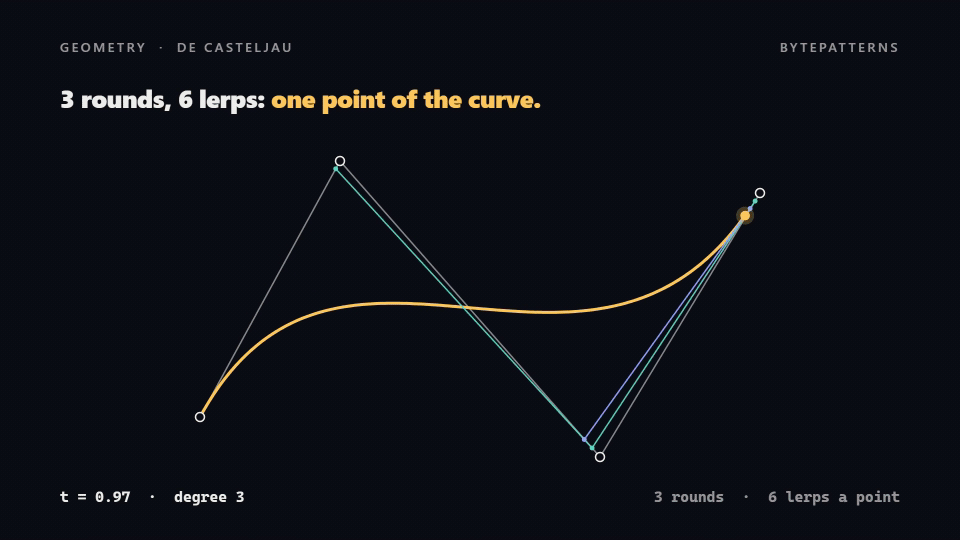</a>
<br><b>58 · Curves from Lerps</b> <sub>27 s</sub>
<br>Generative: de Casteljau's construction turns 4 control points into a cubic Bézier curve with 6 lerps a point, raises it through degrees 3, 4, 5, 7 (up to 28 lerps a point), then cuts the cubic at t = ½ 4 times into 16 pieces whose polygons close in from 28.6% to 0.24% of the curve's length, about 3.9× per cut.
<br><sub><a href="https://bytepatterns.github.io/motion-lab/projects/58-de-casteljau/">open in browser</a> · <a href="out/58-de-casteljau.png">still</a> · <a href="projects/58-de-casteljau/index.html">source</a></sub>
</td>
<td width="28%" valign="top">
<a href="https://bytepatterns.github.io/motion-lab/projects/58-de-casteljau/?variant=vertical">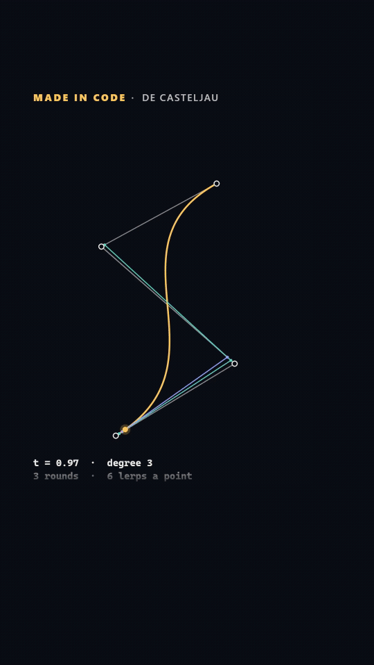</a>
<br><sub>9:16 · 20 s</sub>
<br><sub><a href="https://bytepatterns.github.io/motion-lab/projects/58-de-casteljau/?variant=vertical">open</a> · <a href="out/58-de-casteljau.vertical.png">still</a></sub>
</td>
</tr>
<tr>
<td width="72%" valign="top">
<a href="https://bytepatterns.github.io/motion-lab/projects/59-kmp-failure-table/">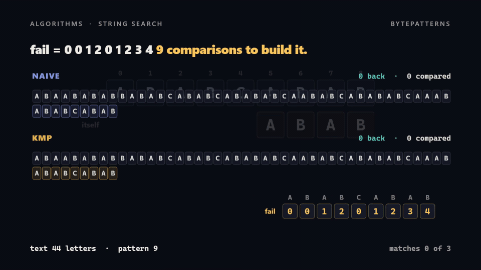</a>
<br><b>59 · KMP: Never Step Back</b> <sub>26 s</sub>
<br>The 9-letter pattern ABABCABAB builds its failure table (0 0 1 2 0 1 2 3 4) in 9 comparisons, then both searches scan a 44-letter text: naive slides one letter and starts over, stepping its text pointer back 45 letters in 103 comparisons, while KMP slides by the table, never steps back and finds the same three matches (at 10, 15, 28, two of them overlapping) in 56.
<br><sub><a href="https://bytepatterns.github.io/motion-lab/projects/59-kmp-failure-table/">open in browser</a> · <a href="out/59-kmp-failure-table.png">still</a> · <a href="projects/59-kmp-failure-table/index.html">source</a></sub>
</td>
<td width="28%" valign="top">
<a href="https://bytepatterns.github.io/motion-lab/projects/59-kmp-failure-table/?variant=vertical">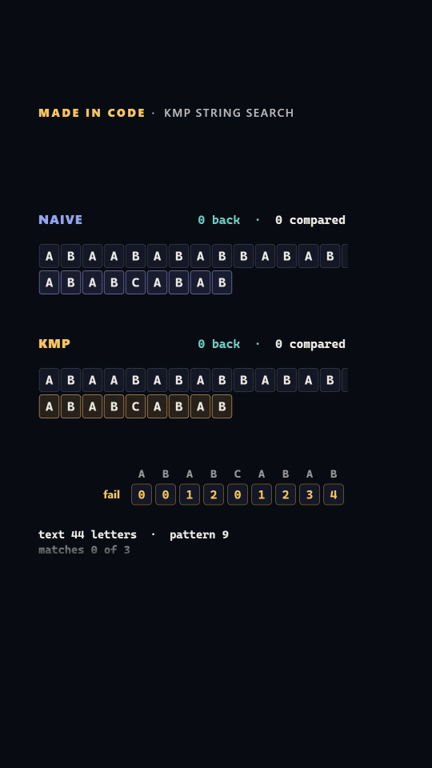</a>
<br><sub>9:16 · 18 s</sub>
<br><sub><a href="https://bytepatterns.github.io/motion-lab/projects/59-kmp-failure-table/?variant=vertical">open</a> · <a href="out/59-kmp-failure-table.vertical.png">still</a></sub>
</td>
</tr>
<tr>
<td width="72%" valign="top">
<a href="https://bytepatterns.github.io/motion-lab/projects/60-union-find/">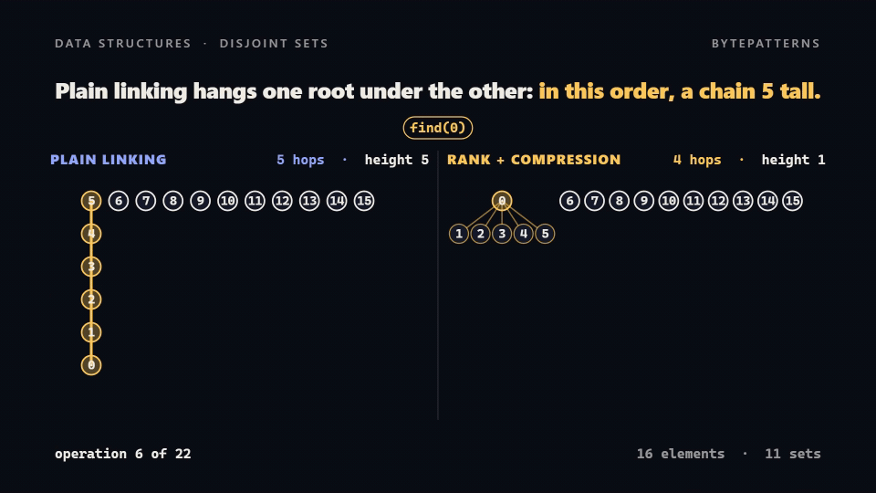</a>
<br><b>60 · Union-Find: Flatten the Forest</b> <sub>27 s</sub>
<br>16 elements go through the same 22 unions and finds twice: plain linking grows a chain 5 tall and ends at height 6 after 40 parent hops, while union by rank with path compression never gets taller than 3, re-points 6 nodes straight at their root and ends at height 2 after 16.
<br><sub><a href="https://bytepatterns.github.io/motion-lab/projects/60-union-find/">open in browser</a> · <a href="out/60-union-find.png">still</a> · <a href="projects/60-union-find/index.html">source</a></sub>
</td>
<td width="28%" valign="top">
<a href="https://bytepatterns.github.io/motion-lab/projects/60-union-find/?variant=vertical">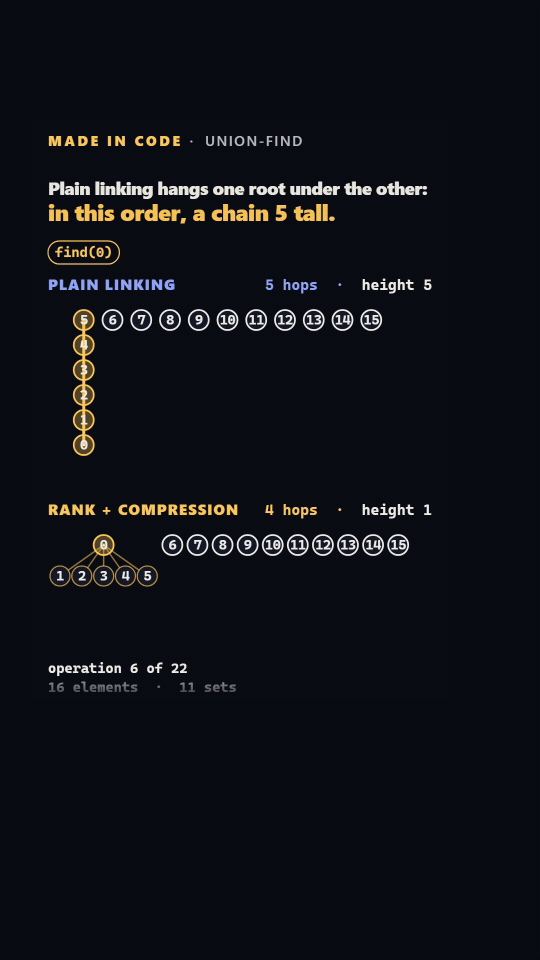</a>
<br><sub>9:16 · 19 s</sub>
<br><sub><a href="https://bytepatterns.github.io/motion-lab/projects/60-union-find/?variant=vertical">open</a> · <a href="out/60-union-find.vertical.png">still</a></sub>
</td>
</tr>
<tr>
<td width="72%" valign="top">
<a href="https://bytepatterns.github.io/motion-lab/projects/61-hyperloglog/">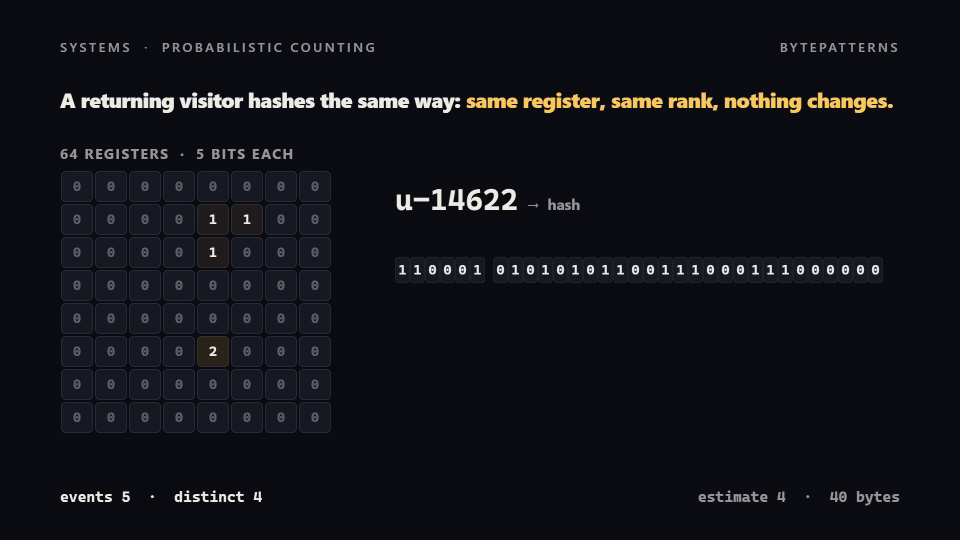</a>
<br><b>61 · HyperLogLog: Count Without Remembering</b> <sub>27 s</sub>
<br>40,000 visits are hashed by visitor id into 64 registers of 5 bits (40 bytes): the first 6 bits of each hash pick a register, which keeps the longest run of leading zeros it has seen, a returning visitor changes nothing, and the harmonic mean of the registers estimates 26,668 distinct visitors against the true 27,589, off by 3.3% where about ±13% is expected, while an exact list of 32-bit hashes would take 108 KB.
<br><sub><a href="https://bytepatterns.github.io/motion-lab/projects/61-hyperloglog/">open in browser</a> · <a href="out/61-hyperloglog.png">still</a> · <a href="projects/61-hyperloglog/index.html">source</a></sub>
</td>
<td width="28%" valign="top">
<a href="https://bytepatterns.github.io/motion-lab/projects/61-hyperloglog/?variant=vertical">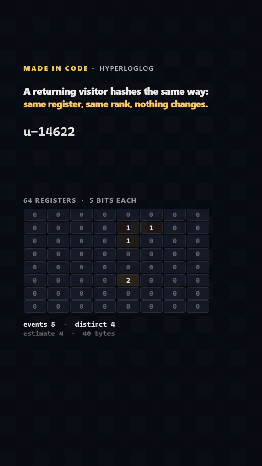</a>
<br><sub>9:16 · 20 s</sub>
<br><sub><a href="https://bytepatterns.github.io/motion-lab/projects/61-hyperloglog/?variant=vertical">open</a> · <a href="out/61-hyperloglog.vertical.png">still</a></sub>
</td>
</tr>
<tr>
<td width="72%" valign="top">
<a href="https://bytepatterns.github.io/motion-lab/projects/62-newton-basins/">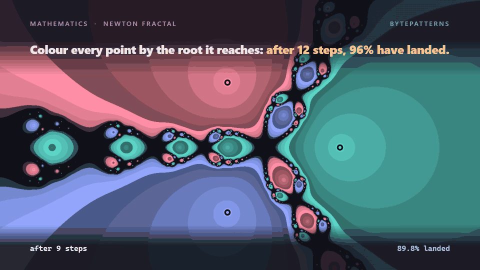</a>
<br><b>62 · Newton's Basins</b> <sub>27 s</sub>
<br>Newton's method on z³ = 1: 4 starting points reach the three roots in 5, 6, 6, 9 steps, then every point of the plane is coloured by the root it reaches, 96% of them within 12 steps (5.8 on average), and a ×64 zoom into a boundary still shows all three basins, in shares of 28.7%, 35.6%, 35.6%.
<br><sub><a href="https://bytepatterns.github.io/motion-lab/projects/62-newton-basins/">open in browser</a> · <a href="out/62-newton-basins.png">still</a> · <a href="projects/62-newton-basins/index.html">source</a></sub>
</td>
<td width="28%" valign="top">
<a href="https://bytepatterns.github.io/motion-lab/projects/62-newton-basins/?variant=vertical">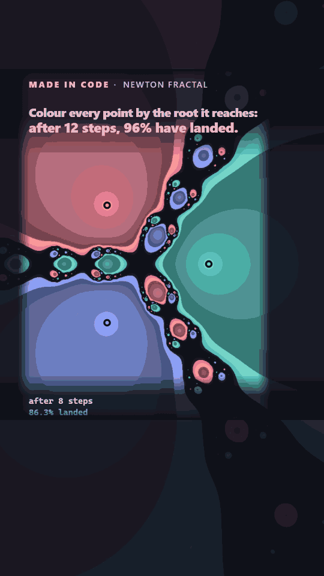</a>
<br><sub>9:16 · 19 s</sub>
<br><sub><a href="https://bytepatterns.github.io/motion-lab/projects/62-newton-basins/?variant=vertical">open</a> · <a href="out/62-newton-basins.vertical.png">still</a></sub>
</td>
</tr>
<tr>
<td width="72%" valign="top">
<a href="https://bytepatterns.github.io/motion-lab/projects/63-wave-function-collapse/">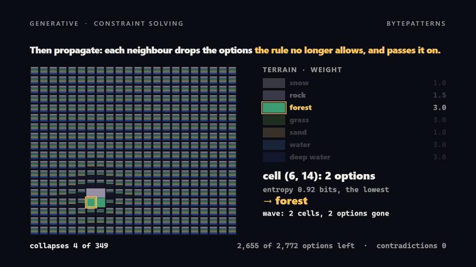</a>
<br><b>63 · Wave Function Collapse</b> <sub>27 s</sub>
<br>A 22 by 18 grid starts with all 7 terrains in every cell and one rule, neighbours differ by at most one level; 349 collapses of the lowest-entropy cell, each followed by propagation, remove 1,875 options, decide 47 more cells by the rule alone and end in a map that is 35% water, with no contradictions.
<br><sub><a href="https://bytepatterns.github.io/motion-lab/projects/63-wave-function-collapse/">open in browser</a> · <a href="out/63-wave-function-collapse.png">still</a> · <a href="projects/63-wave-function-collapse/index.html">source</a></sub>
</td>
<td width="28%" valign="top">
<a href="https://bytepatterns.github.io/motion-lab/projects/63-wave-function-collapse/?variant=vertical">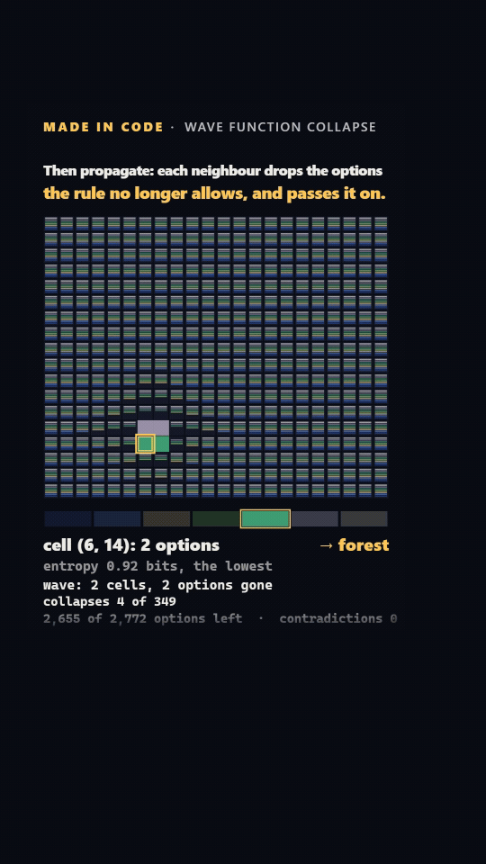</a>
<br><sub>9:16 · 20 s</sub>
<br><sub><a href="https://bytepatterns.github.io/motion-lab/projects/63-wave-function-collapse/?variant=vertical">open</a> · <a href="out/63-wave-function-collapse.vertical.png">still</a></sub>
</td>
</tr>
</table>
<!-- gallery:end -->

## Quick start

```bash
git clone https://github.com/bytepatterns/motion-lab.git
cd motion-lab
npm i                               # Playwright + its headless Chromium
node tools/render.mjs 01-showreel   # -> out/01-showreel.mp4 (1920x1080, 30 fps, AAC)
```

Or skip the install and just open `projects/01-showreel/index.html` in a browser.

Requirements: **Node 20+** and **ffmpeg + ffprobe** on your PATH.

| Command | What it does |
|---|---|
| `node tools/render.mjs NN-slug` | draws every frame headless, pipes the PNGs into ffmpeg (h264, yuv420p, crf 18), muxes the synthesized soundtrack → `out/NN-slug.mp4` |
| `node tools/still.mjs NN-slug [frame ...]` | poster frame → `out/NN-slug.png`; with frame numbers → `out/stills/` |
| `node tools/gif.mjs NN-slug` | a 6-8 s, 960 px, ≤ 3 MB loop with a two-pass palette → `out/NN-slug.gif` |
| `node tools/verify.mjs NN-slug` | checks the piece and its MP4 against the contract, exits 1 on failure |
| `node tools/all.mjs [NN-slug ...]` | render + still + gif + verify for every piece, then rebuilds this gallery |
| `node tools/build-readme.mjs` | rebuilds the gallery above from `projects/*/index.html` |

`render.mjs` takes `--workers N` (parallel pages), `--range a:b` (a quick preview of a few frames) and `--keep-frames` (also write the PNGs to `out/frames/`). Every tool takes `--variant vertical` for a piece's 9:16 cut.

## Vertical cuts for Reels/Shorts/TikTok

Every piece also has a 1080×1920, 12–20 s cut, recomposed from the same scene code with all type inside the area no platform covers, a hook on the first frame and a closing card — it is the right-hand column of the gallery, and `?variant=vertical` plays it in the browser. `node tools/all.mjs --variant vertical` renders them to `out/NN-slug.vertical.mp4`, and `verify` checks the safe area on top of the usual contract (see [CONTRACT.md](CONTRACT.md#7-variants-optional-the-vertical-cut)).

## How a piece works

Every piece exposes one object, and the tools use nothing else:

```js
window.__motion = {
  title, description,           // shown in the gallery
  fps: 30, width: 1920, height: 1080,
  frames: 540,                  // 15-30 s
  seek(i) {},                   // draws frame i: synchronous, a pure function of i
  async audio() {},             // the whole soundtrack as one AudioBuffer (OfflineAudioContext, 48 kHz stereo)
};
```

- **`seek(i)` is pure.** No clock, no `Math.random` — randomness comes from a seeded PRNG (`mulberry32`). Frame 400 looks the same whether it is drawn first, last or twice, so the renderer draws frames in parallel and out of order, and `verify` re-draws random frames to prove it.
- **Sound is scheduled from frame numbers.** A kick on frame 45 is `at = 45 / 30` seconds in the `OfflineAudioContext`, so picture and sound cannot drift.
- **The browser and the renderer run the same code.** In a tab, a small player block calls `seek` from `requestAnimationFrame` and starts the sound on your first click; in the renderer it stays out of the way.

The full rules — canvas, fonts, determinism, audio format, what `verify` checks — are in **[CONTRACT.md](CONTRACT.md)**.

## What `verify` checks

| Group | Checks |
|---|---|
| file | one self-contained file: no external `src` / `href`, no CSS imports, has a `<title>` |
| page | loads without errors and without a single network request; `__motion` has 30 fps, 1920×1080, 450-900 frames |
| frames | random frames are not empty, are pixel-identical when re-drawn out of order, and `seek` never calls `Math.random`, `Date.now` or `performance.now` |
| audio | 2 channels, 48 kHz, exactly `frames / fps` seconds, not silent, no clipping |
| mp4 | h264 1920×1080 yuv420p, duration within 0.1 s, audio stream present and audible |
| luma | every frame of the MP4 decoded: none near-black, none a flat colour |
| safe | vertical cuts only: on 7 frames nothing brighter than luma 70 outside x 60..900, y 230..1400 |

## Add your own piece

1. `cp -r template projects/11-my-piece` (the folder name is `NN-slug`, and the file must stay `index.html`).
2. Replace `draw(f)` and `renderAudio()` with your own; set `title`, `description`, `frames`.
3. Open it in a browser while you work. `?frame=240` freezes on a frame, `Space` pauses.
4. `node tools/all.mjs 11-my-piece` — then look at a few frames with `node tools/still.mjs 11-my-piece 30 240 480`.

If `verify` fails, the piece is fixed — never the tool.

## Project layout

```
projects/NN-slug/index.html   one piece = one file
template/index.html           starter piece with the player block and helpers
tools/                        render, still, gif, verify, all, build-readme (+ lib.mjs)
out/                          GIFs and posters (also *.vertical.*) are committed; MP4s and frames are not
CONTRACT.md                   the rules every piece follows
```

## More from BytePatterns

Animated algorithm lessons, free and without an account: [bytepatterns.com](https://bytepatterns.com?utm_source=github&utm_medium=readme&utm_campaign=motion-lab) · the reel engine: [code-motion](https://github.com/bytepatterns/code-motion)

## License

[MIT](LICENSE). The soundtracks are synthesized by the code in each file, so they carry no third-party licence.
